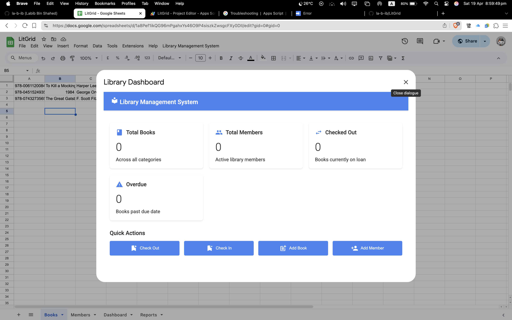
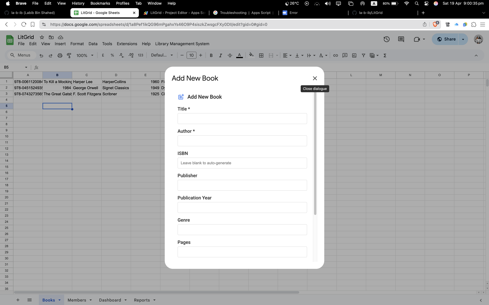
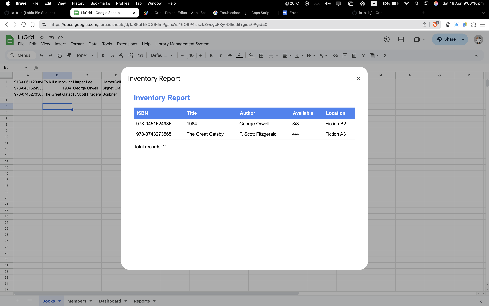
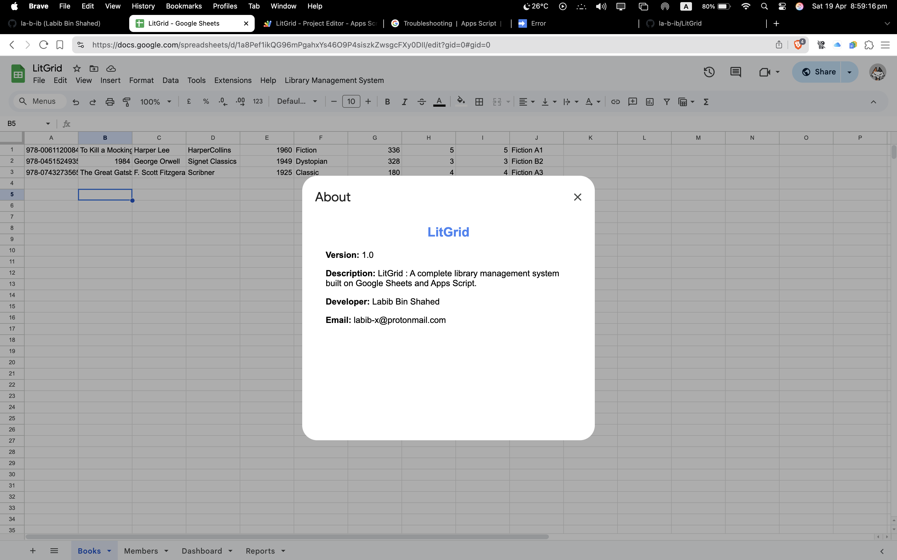
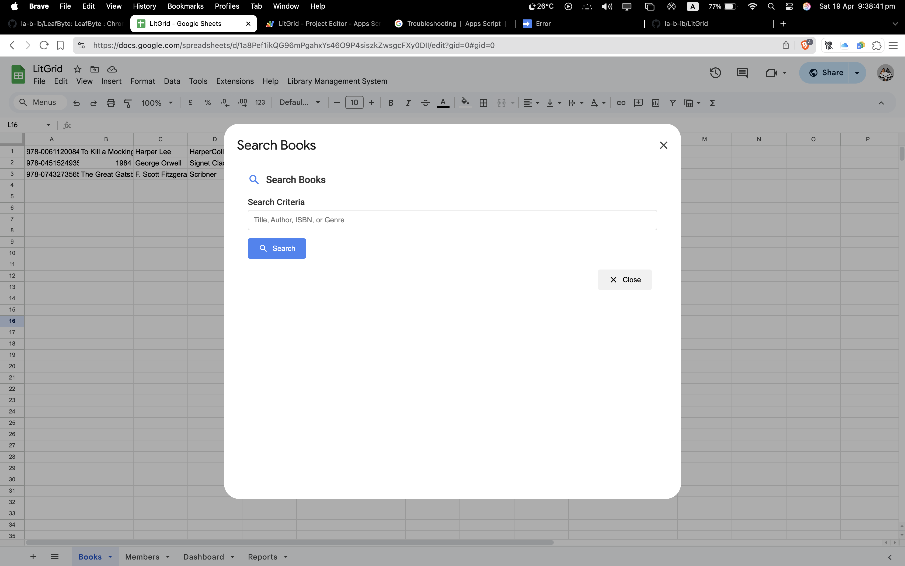

#  LitGrid - Library Management System

**LitGrid** is a modern, cloud-based Library Management System designed for small to medium-sized libraries, offering a free and user-friendly solution built entirely on Google Sheets and Google Apps Script. Developed by Labib Bin Shahed, this system provides a comprehensive set of features, including book and member management, circulation tracking with check-in/check-out functionality, automatic fine calculation for overdue books, and detailed reporting for inventory and member activity. With its Material Design interface, LitGrid ensures an intuitive and visually appealing user experience, accessible from any device with a web browser, requiring no server costs or software installation since it leverages Google’s infrastructure. Perfect for small libraries, non-profits, book clubs, or anyone seeking a lightweight alternative to expensive library management software, LitGrid simplifies library operations with real-time data and automated processes, all manageable with just a Google Account.



**LitGrid** is a comprehensive Library Management System built on Google Sheets and Google Apps Script, offering a modern, feature-rich solution for small to medium-sized libraries.

---

##  Project Links

- **GitHub Repository**: [https://github.com/la-b-ib/LitGrid](https://github.com/la-b-ib/LitGrid)
- **Live Google Sheet**: [Open Template Sheet](https://docs.google.com/spreadsheets/d/1a8Pef1ikQG96mPgahxYs46O9P4siszkZwsgcFXy0DII/edit?usp=sharing)

---

##  Features

###  Book Management
- Add/edit books with complete details (title, author, ISBN, etc.)
- Track copies and availability
- Advanced search functionality



###  Member Management
- Add/edit member profiles
- Track membership status
- Comprehensive member search


###  Circulation System
- Check-out books with due dates
- Check-in books with automatic fine calculation
- Transaction history tracking

###  Fines System
- Automatic calculation of overdue fines
- Fine payment tracking
- Overdue notifications

###  Reporting & Analytics
- Inventory reports
- Overdue books reports
- Member activity analytics



###  Modern UI
- Material Design interface
- Responsive layouts
- Intuitive navigation


---

## 🖥️ Preview

| Feature            | Screenshot                  |
|--------------------|-----------------------------|
| About Page         |   |
| Book Search        |  |
| Dashboard Overview |  |

---

##  Technical Specifications

### Backend
- **Platform**: Google Apps Script
- **Data Storage**: Google Sheets
- **Authentication**: Google Account integration

### Frontend
- **UI Framework**: HTML/CSS with Material Design
- **Icons**: Google Material Icons
- **Fonts**: Google Fonts (Roboto)

### Key Technologies
- Google Sheets API
- HTML Service (for custom dialogs)
- JavaScript ES6

---

##  Getting Started

### Prerequisites
- Google Account
- Access to Google Sheets
- Basic understanding of Google Apps Script

### Installation

1. **Clone the repository**:
   ```bash
   git clone https://github.com/la-b-ib/LitGrid.git
   ```

2. **Open the Google Sheet**:
   - Make a copy of [the template sheet](https://docs.google.com/spreadsheets/d/1a8Pef1ikQG96mPgahxYs46O9P4siszkZwsgcFXy0DII/edit?usp=sharing)
   - Go to `Extensions > Apps Script`
   - Replace the default code with the contents of `LibrarySystem.gs`
   - Create HTML files for each template (`Dashboard.html`, `AddBookForm.html`, etc.)

3. **Initialize the system**:
   - Run the `initializeSystem()` function once to set up the sheets
   - Reload the sheet to see the custom menu

---

##  GitHub Workflow

1. **Fork the repository** to your GitHub account
2. **Create a branch** for your feature/fix:
   ```bash
   git checkout -b feature/your-feature-name
   ```
3. **Commit your changes**:
   ```bash
   git commit -m "Add your commit message here"
   ```
4. **Push to the branch**:
   ```bash
   git push origin feature/your-feature-name
   ```
5. **Create a Pull Request** on GitHub

---

##  Impact

LitGrid simplifies library operations through a fully cloud-based system. It supports real-time data, automated circulation, and fine tracking, promoting digital transformation in education and learning environments.

---

# About


---

## Contact

- **Developer**: Labib Bin Shahed
- **Email**: [labib-x@protonmail.com](mailto:labib-x@protonmail.com)  
- **GitHub**: [github.com/la-b-ib](https://github.com/la-b-ib)

---

## License

This project is licensed under the MIT License. See `LICENSE` file for details.

---

**Happy Reading and Managing Your Library with LitGrid**
