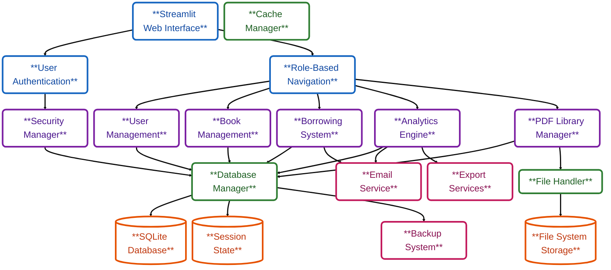

## <samp>LitGrid

<samp>
  
**LitGrid is a comprehensive, modern library management system designed for educational institutions, public libraries, and private collections. Built with **Python**, **Streamlit**, and SQLite, it offers a complete solution for managing books, users, borrowing activities, and administrative tasks. </samp>**

  
**
LitGrid Overview
**

- **Project Goals – Full library management (catalog, users, borrowing, fines), intuitive dashboards, advanced analytics, multi-layer security, MIT open source.**

- **Unique Value – Single-file Python deployment (7.9k LOC), PDF sharing system, fuzzy search, real-time analytics, privacy controls, multi-role support, offline SQLite storage.**

- **Core Features – Catalog & user management, check-in/out with renewals, fine tracking, inventory with barcodes, AI-powered recommendations, role-based dashboards, community reviews, personal analytics.**

- **Enterprise Tools – 20+ visualizations, financial/member/collection reports, MFA, encryption, audit logs, rate limiting, DB backup/restore, bulk ops, barcode/QR utilities, JSON config manager.**

  
**
LitGrid Preview
**

  

  
  
   
  
  

  
**
Core Components
**

- **Presentation Layer** – Streamlit UI with custom CSS, secure session authentication, and role‑based dynamic navigation.  
- **Business Logic Layer** – User and book management with CRUD, fuzzy search, AI recommendations, borrowing/renewals/fines, analytics engine, encryption, audit logging, RBAC, and advanced PDF library with privacy controls.  
- **Data Layer** – SQLite with connection pooling and integrity checks, PDF/image handling with backup/restore, and cache manager for session state and temporary data.  

  
**
Quick Start
**

* **Prerequisites** – Requires Python 3.13+, pip, Git, and SQLite3 (bundled with Python).
* **Setup** – `git clone https://github.com/la-b-ib/LitGrid.git && cd LitGrid` → `pip install -r requirements.txt`  
* **Run** – `streamlit run litgrid.py` → open `http://localhost:8501`  
* **Access** – Login with demo (`demo/demo123`) or register as new member to explore features.

  
**
User Roles & Permissions
**

* **Member** – Browse/search catalog, manage profile, upload/share PDFs, request checkouts/returns, rate/review, track stats.  
* **Librarian** – Member rights + manage books/inventory, process/approve checkouts/renewals, handle fines/payments, generate reports.  
* **Administrator** – Librarian rights + user management, system config, DB backup/restore, advanced analytics, security/audit, monitoring.  

  
**
Genre Performance Tracking
**

- **Library Metrics** – Real‑time stats (books, users, transactions, fines), trend analysis, performance indicators, and health monitoring.  
- **Genre & Community Insights** – Circulation by genre, user preferences, seasonal trends, collection balance, leaderboards, reviews, and PDF contributions.  
- **Advanced Analytics** – Multi‑dimensional visualizations (3D plots, heatmaps), correlation analysis, and predictive demand forecasting.  
- **Password Security** – Bcrypt hashing with salt, complexity validation, token‑based reset, and secure session management.

  
**
System Architecture
**

  
