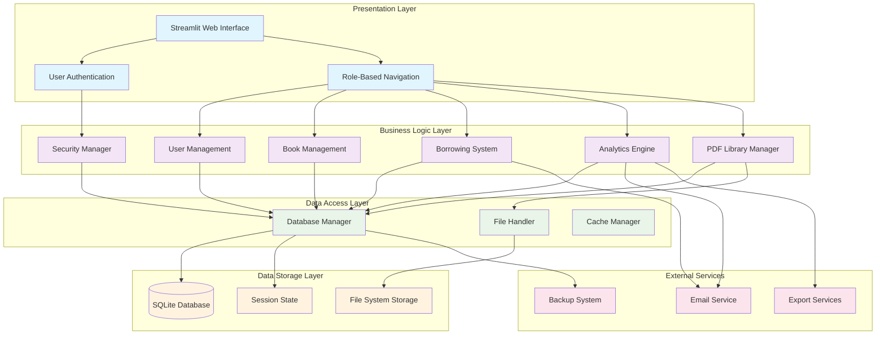
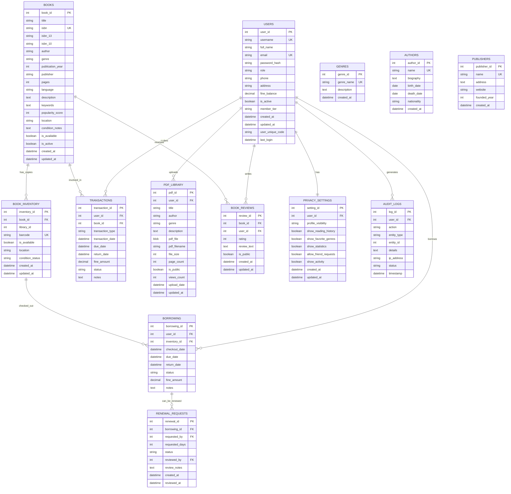
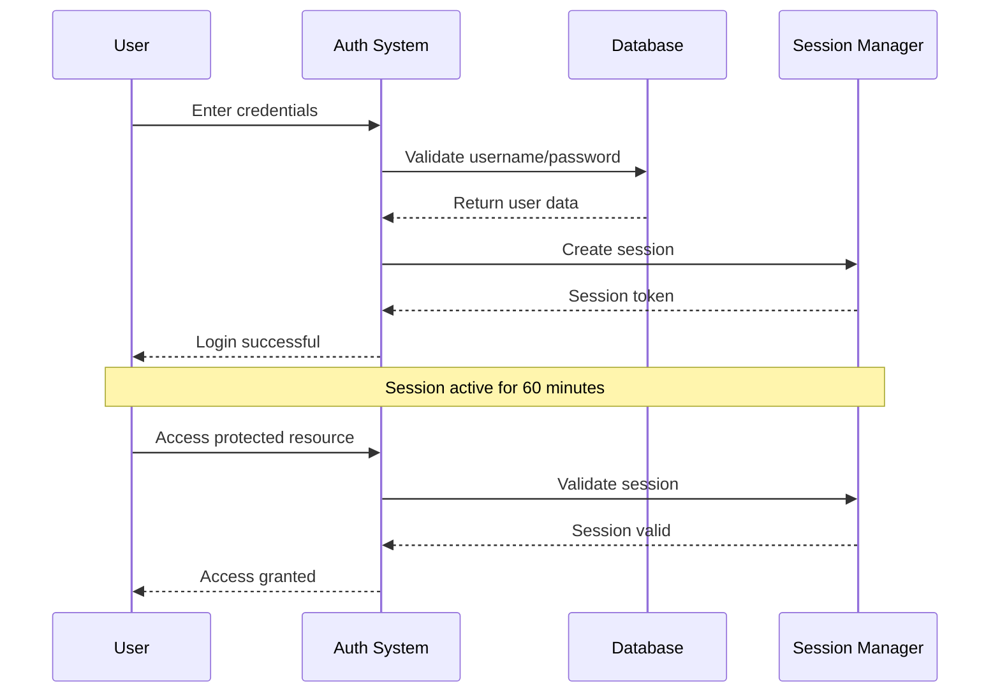
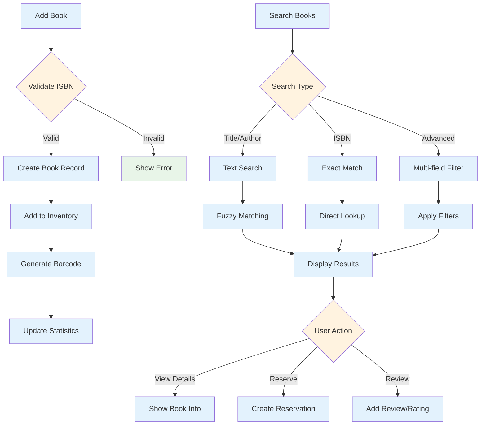
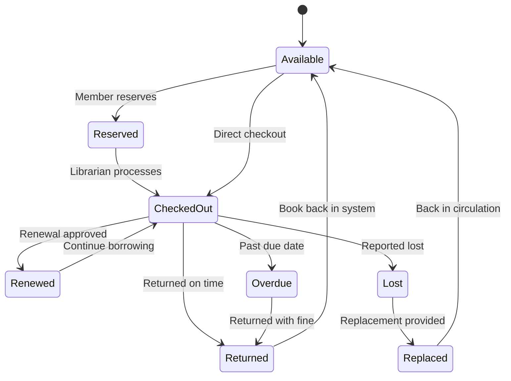
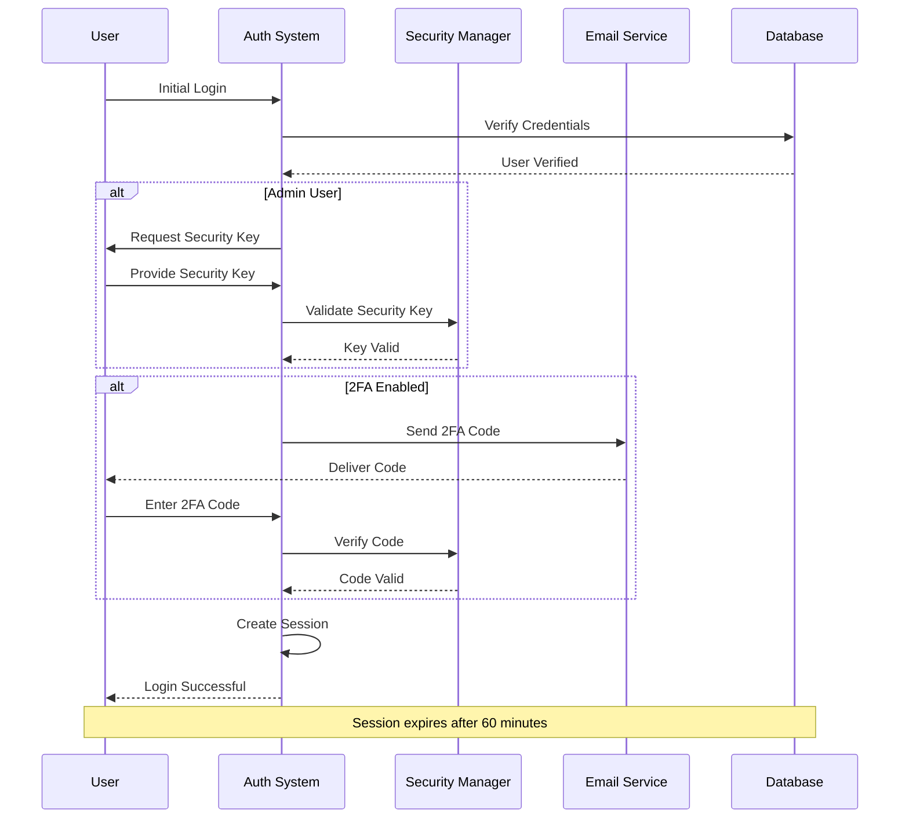
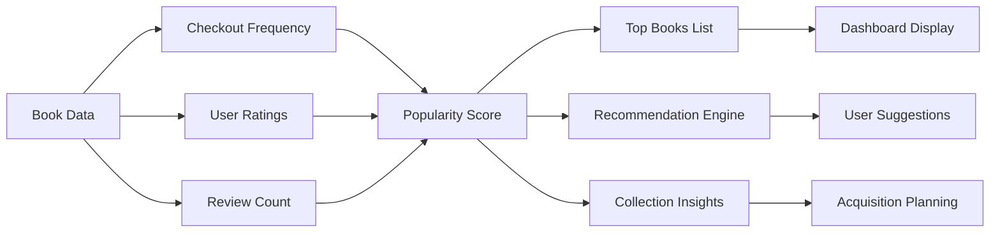

## LitGrid 

**LitGrid** is a comprehensive, modern library management system designed for educational institutions, public libraries, and private collections. Built with **Python**, **Streamlit**, and **SQLite**, it offers a complete solution for managing books, users, borrowing activities, and administrative tasks.

<hr>

<div align="left">


[](https://www.gnu.org/licenses/agpl-3.0)
[](https://www.python.org/)
[](https://streamlit.io/)
[](https://www.sqlite.org/)
[](https://litgrid.streamlit.app/)


</div>

---


## Project Goals

- **Complete Library Management**: From book cataloging to user management
- **User-Friendly Interface**: Intuitive web-based dashboard for all user types  
- **Advanced Analytics**: Comprehensive reporting and data visualization
- **Security First**: Multi-layer authentication and data protection
- **Open Source**: MIT licensed for community collaboration

<hr>

##  What Makes LitGrid Special

- **All-in-One Solution**: Single file deployment with 7900+ lines of Python code
- **Advanced PDF Library**: Personal and community PDF sharing system
- **Smart Search**: Fuzzy search with typo tolerance
- **Real-time Analytics**: Live dashboards with 20+ visualization types
- **Privacy Controls**: Anonymous mode and granular privacy settings
- **Multi-role Support**: Member, Librarian, and Administrator roles
- **Offline Capable**: SQLite database for reliable local storage

---

## Key Features

### 📚 **Core Library Management**
- **Book Catalog Management**: Add, edit, delete, and search books with ISBN validation
- **User Management**: Member registration, role-based access, user profiles
- **Borrowing System**: Check-out/check-in with due date tracking and renewals
- **Fine Management**: Automated fine calculation and payment tracking
- **Inventory Control**: Multiple copies per book with barcode generation

<hr> 

### 🔍 **Advanced Search & Discovery**
- **Fuzzy Search Engine**: Typo-tolerant search across titles, authors, genres
- **Multi-field Filtering**: Genre, year, availability, rating-based filters
- **Smart Recommendations**: AI-powered book suggestions based on user history
- **Advanced Sorting**: Popularity, rating, date added, alphabetical options

<hr>

### 👥 **User Experience**
- **Role-Based Dashboards**: Customized interfaces for members, librarians, admins
- **Personal Library**: Upload and share PDFs with privacy controls
- **Community Features**: Browse public libraries, rate books, leave reviews
- **Reading Analytics**: Personal statistics, reading patterns, goal tracking

<hr>

### 📊 **Analytics & Reporting**
- **20+ Visualization Types**: Charts, graphs, heatmaps, 3D scatter plots
- **Financial Reports**: Fine collection, revenue projections, payment tracking
- **Member Analytics**: Top borrowers, inactive members, tier distribution
- **Collection Insights**: Most popular books, genre performance, acquisition trends

<hr>

### 🔐 **Security & Privacy**
- **Multi-Factor Authentication**: Standard login + admin security keys
- **Anonymous Mode**: Pseudonym-based browsing with privacy protection
- **Data Encryption**: Sensitive information encrypted at rest
- **Audit Logging**: Complete activity tracking for compliance
- **Rate Limiting**: Protection against brute force attacks

<hr>

### 🛠️ **Administrative Tools**
- **System Management**: Database backup/restore, integrity checks
- **Bulk Operations**: CSV import/export, batch user registration
- **Smart Utilities**: Barcode/QR generation, spell checking, duplicate detection
- **Configuration Manager**: JSON-based settings with runtime updates

---

## System Architecture

**LitGrid follows a modular, layered architecture designed for maintainability and scalability:**


<hr>

## Core Components

### 🎨 **Presentation Layer**
- **Streamlit Web Interface**: Modern, responsive UI with custom CSS styling
- **Authentication System**: Secure login with session management
- **Navigation Components**: Dynamic menus based on user roles

<hr>

### 🔧 **Business Logic Layer**
- **User Management**: Registration, profiles, privacy settings
- **Book Management**: CRUD operations, search, recommendations
- **Borrowing System**: Check-out/in, renewals, fine calculation
- **Analytics Engine**: Data processing, visualization generation
- **Security Manager**: Encryption, audit logging, access control
- **PDF Library Manager**: File upload, sharing, community features

<hr>

### 💾 **Data Layer**
- **Database Manager**: SQLite operations with connection pooling
- **File Handler**: PDF processing, image handling, backup operations
- **Cache Manager**: Session state and temporary data management

---

## Database Schema

**LitGrid uses a comprehensive SQLite database with 25+ tables supporting all features:**



<hr>

## Key Relationships

- **Users ↔ Books**: Many-to-many through borrowing and transactions
- **Books ↔ Inventory**: One-to-many for multiple copies
- **Users ↔ PDF Library**: One-to-many for personal collections
- **Books ↔ Reviews**: One-to-many for community feedback
- **Users ↔ Privacy**: One-to-one for personal settings

---

## Installation & Setup

### 📋 Prerequisites

- **Python 3.13+** (recommended)
- **pip** package manager
- **Git** for version control
- **SQLite3** (included with Python)

<hr>

### ⚡ Quick Start (5 minutes)

1. **Clone the Repository**
   ```bash
   git clone https://github.com/la-b-ib/LitGrid.git
   cd LitGrid
   ```

2. **Install Dependencies**
   ```bash
   pip install -r requirements.txt
   ```

3. **Run the Application**
   ```bash
   streamlit run litgrid.py
   ```

4. **Access the System**
   - Open your browser to `http://localhost:8501`
   - Use demo credentials: `demo` / `demo123` (Admin)
   - Register as a new member to explore user features

<hr>

### 🔧 Advanced Installation

```bash
# Create virtual environment
python -m venv litgrid_env

# Activate environment
# On Windows:
litgrid_env\Scripts\activate
# On macOS/Linux:
source litgrid_env/bin/activate

# Install dependencies
pip install -r requirements.txt
```

```dockerfile
FROM python:3.13-slim

WORKDIR /app
COPY requirements.txt .
RUN pip install -r requirements.txt

COPY . .
EXPOSE 8501

CMD ["streamlit", "run", "litgrid.py", "--server.port=8501", "--server.address=0.0.0.0"]
```

```bash
# Build and run Docker container
docker build -t litgrid .
docker run -p 8501:8501 litgrid
```

---

## Configuration

### ⚙️ Environment Variables : Create a `.env` file in the project root:

```env
# Database Configuration
SQLITE_DB=litgrid_local.db
DB_BACKUP_INTERVAL=24  # hours

# Application Settings
SESSION_TIMEOUT=60  # minutes
DEFAULT_BORROWING_DAYS=14
FINE_PER_DAY=5.00
MAX_RENEWALS=2
MAX_MEMBER_ACCOUNTS=10

# Security Settings
SECRET_KEY=your-super-secret-key-change-this
ENCRYPTION_KEY=your-32-character-encryption-key
ENABLE_2FA=true
RATE_LIMIT_ATTEMPTS=5

# Email Configuration (Optional)
SMTP_SERVER=smtp.gmail.com
SMTP_PORT=587
SMTP_USERNAME=your-email@gmail.com
SMTP_PASSWORD=your-app-password
SMTP_FROM_EMAIL=noreply@litgrid.com

# Feature Flags
ENABLE_PDF_LIBRARY=true
ENABLE_COMMUNITY_FEATURES=true
ENABLE_ANALYTICS=true
ENABLE_BARCODE_GENERATION=true
```

### 📁 Directory Structure

```
LitGrid/
├── litgrid.py                 # Main application (7900+ lines)
├── requirements.txt           # Python dependencies
├── litgrid_local.db          # SQLite database
├── README.md                 # This documentation
├── LICENSE                   # MIT License
├── DEPLOYMENT_GUIDE.md       # Deployment instructions
├── CONTRIBUTING.md           # Contribution guidelines
├── SECURITY.md               # Security policy
├── CODE_OF_CONDUCT.md        # Community guidelines
├── secrets.example.toml      # Secrets template
├── .streamlit/
│   └── config.toml           # Streamlit configuration
├── backups/                  # Database backups
├── temp/                     # Temporary files
├── uploads/                  # File uploads
└── logs/                     # Application logs
```

### 🎛️ Streamlit Configuration

Create `.streamlit/config.toml`:

```toml
[global]
developmentMode = false

[server]
port = 8501
enableCORS = false
enableXsrfProtection = true
maxUploadSize = 50

[theme]
primaryColor = "#1E88E5"
backgroundColor = "#FFFFFF"
secondaryBackgroundColor = "#F0F2F6"
textColor = "#262730"

[browser]
gatherUsageStats = false
```

---

## User Roles & Permissions

### 🎭 **Member Role**
- Browse and search book catalog
- Request book checkouts and returns
- Manage personal profile and privacy settings
- Upload and share PDFs in personal library
- Rate and review books
- View personal reading statistics

<hr>

### 📋 **Librarian Role**  
- All member permissions plus:
- Add, edit, and delete books
- Manage book inventory and copies
- Process checkouts and returns
- Approve renewal requests
- Generate reports and analytics
- Manage fines and payments

<hr>

### 👨‍💼 **Administrator Role**
- All librarian permissions plus:
- User management (add, edit, delete users)
- System configuration and settings
- Database backup and restore
- Advanced analytics and reporting
- Security management and audit logs
- System monitoring and maintenance

<hr>

## Authentication System



<hr>

### 🔒 Admin Security
- **Primary Login**: Standard username/password
- **Security Key**: Additional password for sensitive operations
- **Functional Admin**: Hidden admin with special privileges
- **Session Management**: Automatic timeout and renewal

<hr>

### 📖 Book Management Workflow


<hr>

### 🔄 Borrowing Process




---

## Code Architecture

**LitGrid is built as a monolithic application with clear separation of concerns:**

### 📁 **Core Classes Overview**

```python
# Security & Authentication
class Auth:                    # User authentication and session management
class SecurityManager:        # Encryption, validation, and security utilities
class AuditLogger:            # Activity logging and compliance tracking
class RateLimiter:            # Brute force protection

# Data Management  
class Database:               # SQLite connection and query management
class Config:                 # Application configuration management

# Business Logic
class EnhancedBookManager:    # Book CRUD operations and catalog management
class EnhancedUserManager:    # User profile and account management
class EnhancedBorrowingManager: # Checkout, return, and renewal workflows
class PeerLibraryManager:     # PDF library and community features
class PrivacyManager:         # Privacy settings and anonymous mode

# Advanced Features
class SmartUtilities:         # Barcode/QR generation, recommendations
class RecommendationEngine:   # AI-powered book suggestions
class FuzzySearchEngine:      # Typo-tolerant search functionality
class ReviewsManager:         # Book reviews and ratings
class ProfileCommentsManager: # User profile interactions

# Analytics & Reporting
class DataValidator:          # Data integrity and validation
class BackupManager:          # Database backup and restore
class ExcelExporter:          # Data export utilities
class EmailService:           # Notification system

# File Handling
class FileHandler:            # File upload and processing
class PDFHandler:             # PDF text extraction and preview
class BarcodeQRGenerator:     # Code generation utilities
class TempFileManager:        # Temporary file cleanup
```

### 🔧 **Key Design Patterns**

1. **Singleton Pattern**: Database connection management
2. **Factory Pattern**: Report generation and export formats
3. **Strategy Pattern**: Search algorithms and filtering
4. **Observer Pattern**: Audit logging and event tracking
5. **Command Pattern**: Bulk operations and batch processing

<hr>

### 🛠️ Development Workflow


1. **Create Feature Branch**
   ```bash
   git checkout -b feature/new-feature-name
   ```

2. **Follow Code Structure**
   ```python
   class NewFeatureManager:
       """Feature description and purpose"""
       
       @staticmethod
       def main_function(params):
           """Main functionality with comprehensive docstring"""
           try:
               # Implementation
               AuditLogger.log_action(user_id, 'feature_used', 'feature', entity_id)
               return True, "Success message"
           except Exception as e:
               st.error(f"Error: {str(e)}")
               return False, str(e)
   ```

3. **Add UI Components**
   ```python
   def show_new_feature():
       """Page function for new feature"""
       st.title("🎯 New Feature")
       
       # Feature implementation
       with st.container():
           # UI elements
           pass
   ```

4. **Update Navigation**
   ```python
   # Add to main menu in main() function
   if user['role'] in ['admin', 'librarian']:
       menu.extend(["New Feature"])
   ```
<hr>

### Testing Guidelines

```python
# Test structure example
def test_book_management():
    """Test book CRUD operations"""
    # Test data
    test_book = {
        'title': 'Test Book',
        'author': 'Test Author',
        'isbn': '978-0123456789'
    }
    
    # Test creation
    success, book_id = EnhancedBookManager.add_book(test_book)
    assert success, "Book creation failed"
    
    # Test retrieval
    book = Database.execute_query(
        "SELECT * FROM books WHERE book_id = ?", 
        (book_id,), 
        fetch_one=True
    )
    assert book['title'] == test_book['title']
    
    # Cleanup
    Database.execute_update("DELETE FROM books WHERE book_id = ?", (book_id,))
```

<hr>

## Performance Optimization

**Database Query Optimization**

```python
# Use indexes for frequent queries
CREATE INDEX idx_books_title ON books(title);
CREATE INDEX idx_borrowing_user_id ON borrowing(user_id);
CREATE INDEX idx_transactions_date ON transactions(transaction_date);

# Batch operations for bulk updates
def bulk_update_books(books_data):
    """Efficient bulk book updates"""
    with Database.get_connection() as conn:
        cursor = conn.cursor()
        cursor.executemany(
            "UPDATE books SET title = ?, author = ? WHERE book_id = ?",
            books_data
        )
        conn.commit()
```

**Streamlit Performance**

```python
# Use caching for expensive operations
@st.cache_data(ttl=300)  # Cache for 5 minutes
def get_analytics_data():
    """Cached analytics data retrieval"""
    return Database.execute_query("SELECT * FROM analytics_view")

# Minimize rerun triggers
if 'data_loaded' not in st.session_state:
    st.session_state.data_loaded = load_initial_data()
```

---

## Database Operations

#### Core Database Class

```python
class Database:
    """SQLite database management with connection pooling"""
    
    @classmethod
    def execute_query(cls, query: str, params: tuple = None, fetch_one: bool = False):
        """
        Execute SELECT query and return results
        
        Args:
            query (str): SQL query with ? placeholders
            params (tuple): Query parameters
            fetch_one (bool): Return single record if True
            
        Returns:
            list|dict|None: Query results
        """
        
    @classmethod  
    def execute_update(cls, query: str, params: tuple = None):
        """
        Execute INSERT/UPDATE/DELETE query
        
        Args:
            query (str): SQL query with ? placeholders
            params (tuple): Query parameters
            
        Returns:
            bool: Success status
        """
```

#### Example Database Usage

```python
# Insert new book
success = Database.execute_update(
    "INSERT INTO books (title, author, isbn) VALUES (?, ?, ?)",
    ("Book Title", "Author Name", "978-0123456789")
)

# Fetch user data
user = Database.execute_query(
    "SELECT * FROM users WHERE username = ?",
    ("john_doe",),
    fetch_one=True
)

# Get all active books
books = Database.execute_query(
    "SELECT * FROM books WHERE is_active = 1 ORDER BY title"
)
```
<hr>

### 🔐 Authentication API

```python
class Auth:
    """Authentication and session management"""
    
    @staticmethod
    def login(username: str, password: str, mode: str = 'member'):
        """
        Authenticate user login
        
        Args:
            username (str): Username or email
            password (str): User password
            mode (str): Login mode ('member', 'admin')
            
        Returns:
            dict|None: User data if successful, None if failed
        """
        
    @staticmethod
    def register(username: str, email: str, password: str, full_name: str, phone: str = None):
        """
        Register new user
        
        Args:
            username (str): Unique username
            email (str): Valid email address
            password (str): Password (min 6 characters)
            full_name (str): User's full name
            phone (str): Optional phone number
            
        Returns:
            tuple: (success: bool, message: str)
        """
```

### 📚 Book Management API

```python
class EnhancedBookManager:
    """Advanced book management operations"""
    
    @staticmethod
    def bulk_import_csv(csv_file) -> tuple:
        """
        Import books from CSV file
        
        Args:
            csv_file: Uploaded CSV file object
            
        Returns:
            tuple: (success: bool, message: str)
        """
        
    @staticmethod
    def upload_book_cover(book_id: int, cover_file) -> bool:
        """
        Upload cover image for book
        
        Args:
            book_id (int): Book identifier
            cover_file: Image file object
            
        Returns:
            bool: Upload success status
        """
```

### 🔍 Search & Filtering API

```python
class EnhancedSearchFilter:
    """Advanced search and filtering capabilities"""
    
    @staticmethod
    def fuzzy_search_books(query: str, threshold: int = 60):
        """
        Perform fuzzy search with typo tolerance
        
        Args:
            query (str): Search term
            threshold (int): Match similarity threshold (0-100)
            
        Returns:
            list: Matching books sorted by relevance
        """
        
    @staticmethod
    def advanced_multi_field_filter(title: str = "", author: str = "", 
                                   genre: str = "", year_from: int = None,
                                   year_to: int = None, available_only: bool = False):
        """
        Advanced multi-field book filtering
        
        Args:
            title (str): Title filter
            author (str): Author filter  
            genre (str): Genre filter
            year_from (int): Start year
            year_to (int): End year
            available_only (bool): Show only available books
            
        Returns:
            list: Filtered book results
        """
```

### 📊 Analytics API

```python
class AnalyticsEngine:
    """Analytics and reporting functionality"""
    
    @staticmethod
    def get_borrowing_trends(start_date: date, end_date: date):
        """
        Generate borrowing trend analysis
        
        Args:
            start_date (date): Analysis start date
            end_date (date): Analysis end date
            
        Returns:
            dict: Trend data with statistics
        """
        
    @staticmethod
    def generate_member_statistics(user_id: int):
        """
        Generate comprehensive member statistics
        
        Args:
            user_id (int): Member identifier
            
        Returns:
            dict: Statistics including books read, favorites, etc.
        """
```

---

## **Authentication & Authorization**

#### Multi-Factor Authentication Flow



#### Role-Based Access Control
```python
# Permission matrix
PERMISSIONS = {
    'member': [
        'view_books', 'search_books', 'borrow_books', 
        'view_profile', 'upload_pdfs', 'rate_books'
    ],
    'librarian': [
        'all_member_permissions', 'manage_books', 'manage_borrowing',
        'view_reports', 'manage_fines', 'approve_renewals'
    ],
    'admin': [
        'all_librarian_permissions', 'manage_users', 'system_config',
        'backup_restore', 'audit_logs', 'security_settings'
    ]
}
```
<hr>

## **Data Protection**

#### Encryption Implementation
```python
class SecurityManager:
    """Advanced security and encryption manager"""
    
    def __init__(self):
        self._init_encryption_key()
        
    def encrypt_data(self, data: str) -> str:
        """Encrypt sensitive data using Fernet encryption"""
        if not data or not self.cipher:
            return data
        return self.cipher.encrypt(data.encode()).decode()
        
    def decrypt_data(self, encrypted_data: str) -> str:
        """Decrypt sensitive data"""
        if not encrypted_data or not self.cipher:
            return encrypted_data
        return self.cipher.decrypt(encrypted_data.encode()).decode()
```

#### Password Security
- **Bcrypt Hashing**: Industry-standard password hashing with salt
- **Password Strength**: Minimum 6 characters with complexity validation
- **Password Reset**: Secure token-based reset mechanism
- **Session Security**: Automatic timeout and secure session tokens

#### **Input Validation & Sanitization**

```python
def sanitize_input(self, text: str) -> str:
    """Sanitize user input to prevent XSS"""
    if not text:
        return text
    # Remove dangerous characters and HTML tags
    text = re.sub(r'<[^>]*>', '', text)
    text = re.sub(r'[<>\"\'`]', '', text)
    return text.strip()

def validate_email(self, email: str) -> bool:
    """Validate email format"""
    pattern = r'^[a-zA-Z0-9._%+-]+@[a-zA-Z0-9.-]+\.[a-zA-Z]{2,}$'
    return bool(re.match(pattern, email))
```

#### **Audit Logging**

```python
class AuditLogger:
    @staticmethod
    def log_action(user_id: int, action: str, entity_type: str, 
                   entity_id: int = None, details: str = None):
        """Log user actions for audit trail"""
        query = """
            INSERT INTO audit_logs 
            (user_id, action, entity_type, entity_id, details, ip_address, status)
            VALUES (?, ?, ?, ?, ?, ?, ?)
        """
        Database.execute_update(query, (user_id, action, entity_type, entity_id, details, ip_address, 'success'))
```

#### **Rate Limiting (Protection against brute force attacks):**


```python
class RateLimiter:
    def check_limit(self, key: str, max_attempts: int = 5, window: int = 300) -> bool:
        """Check if action is rate limited"""
        now = time.time()
        
        # Clean old attempts
        self.attempts[key] = [t for t in self.attempts.get(key, []) if now - t < window]
        
        # Check limit
        if len(self.attempts.get(key, [])) >= max_attempts:
            return False
            
        # Record attempt
        if key not in self.attempts:
            self.attempts[key] = []
        self.attempts[key].append(now)
        return True
```

---

## Analytics & Reporting


#### Library Overview Metrics
- **Real-time Statistics**: Books, users, transactions, fines
- **Trend Analysis**: Daily, weekly, monthly borrowing patterns
- **Performance Indicators**: Turnover rate, popularity scores
- **Health Metrics**: Overdue books, system status, user activity

#### Visual Components
```python
# Borrowing trend visualization
def generate_borrowing_trend():
    data = Database.execute_query("""
        SELECT date(checkout_date) as date, COUNT(*) as count
        FROM borrowing
        WHERE checkout_date >= date('now', '-30 days')
        GROUP BY date(checkout_date)
        ORDER BY date
    """)
    
    fig = go.Figure()
    fig.add_trace(go.Scatter(
        x=[row['date'] for row in data],
        y=[row['count'] for row in data],
        mode='lines+markers',
        name='Daily Checkouts'
    ))
    return fig
```

#### Popular Books Analysis



#### Genre Performance Tracking
- **Circulation Statistics**: Borrows per genre over time
- **User Preferences**: Most requested genres by demographics
- **Collection Balance**: Genre distribution analysis
- **Seasonal Trends**: Genre popularity by time periods

<hr>

## **Analytics**

#### User Behavior Analysis

```python
def analyze_reading_patterns(user_id):
    """Comprehensive user reading pattern analysis"""
    patterns = {
        'favorite_genres': get_top_genres(user_id),
        'reading_frequency': calculate_reading_frequency(user_id),
        'preferred_authors': get_favorite_authors(user_id),
        'seasonal_patterns': analyze_seasonal_reading(user_id),
        'book_length_preference': analyze_page_preferences(user_id)
    }
    return patterns
```

#### Leaderboards & Gamification

- **Top Readers**: Most books borrowed by period
- **Review Champions**: Most helpful reviews
- **Genre Explorers**: Users reading across multiple genres
- **Community Contributors**: PDF sharing and ratings


#### Financial Analytics (Revenue Tracking)

```python
def generate_financial_report(start_date, end_date):
    """Comprehensive financial analysis"""
    return {
        'fine_collection': calculate_fines_collected(start_date, end_date),
        'outstanding_fines': get_outstanding_fines(),
        'payment_trends': analyze_payment_patterns(),
        'revenue_projections': project_future_revenue(),
        'cost_analysis': calculate_operational_costs()
    }
```


#### Multi-Dimensional Analysis

- **3D Scatter Plots**: Book popularity vs. rating vs. age
- **Heatmaps**: Usage patterns by time and location
- **Correlation Analysis**: User behavior relationships
- **Predictive Analytics**: Future demand forecasting

#### Export Capabilities

```python
class ReportExporter:
    """Export reports in multiple formats"""
    
    def export_to_excel(self, data, report_type):
        """Export with advanced formatting"""
        wb = Workbook()
        ws = wb.active
        
        # Apply styling, charts, and calculations
        self.apply_excel_formatting(ws, data)
        self.add_charts(ws, data, report_type)
        
        return wb
        
    def export_to_pdf(self, data, template):
        """Generate professional PDF reports"""
        # PDF generation with charts and formatting
        pass
```

---

## Deployment


#### Quick Deploy to Streamlit Cloud

1. **Push to GitHub**: Ensure all files are in a public repository
2. **Connect to Streamlit Cloud**: Visit [share.streamlit.io](https://share.streamlit.io)
3. **Configure App**: Select repository, branch, and main file (`litgrid.py`)
4. **Set Secrets**: Add environment variables in app settings

```toml
# secrets.toml for Streamlit Cloud
[database]
SQLITE_DB = "litgrid_local.db"

[security]
SECRET_KEY = "your-production-secret-key"
ENCRYPTION_KEY = "your-32-character-encryption-key"

[email]
SMTP_SERVER = "smtp.gmail.com"
SMTP_PORT = 587
SMTP_USERNAME = "your-email@gmail.com"
SMTP_PASSWORD = "your-app-password"
```

#### 🐳 **Docker Deployment**

```dockerfile
FROM python:3.13-slim

# Set working directory
WORKDIR /app

# Install system dependencies
RUN apt-get update && apt-get install -y \
    sqlite3 \
    && rm -rf /var/lib/apt/lists/*

# Copy requirements and install Python dependencies
COPY requirements.txt .
RUN pip install --no-cache-dir -r requirements.txt

# Copy application files
COPY . .

# Create necessary directories
RUN mkdir -p backups temp uploads logs

# Set environment variables
ENV PYTHONUNBUFFERED=1
ENV STREAMLIT_SERVER_PORT=8501
ENV STREAMLIT_SERVER_ADDRESS=0.0.0.0

# Expose port
EXPOSE 8501

# Health check
HEALTHCHECK --interval=30s --timeout=10s --start-period=5s --retries=3 \
    CMD curl -f http://localhost:8501/_stcore/health || exit 1

# Run application
CMD ["streamlit", "run", "litgrid.py", "--server.port=8501", "--server.address=0.0.0.0"]
```

#### Docker Compose
```yaml
version: '3.8'

services:
  litgrid:
    build: .
    ports:
      - "8501:8501"
    volumes:
      - ./data:/app/data
      - ./backups:/app/backups
      - ./logs:/app/logs
    environment:
      - SQLITE_DB=/app/data/litgrid.db
      - SECRET_KEY=${SECRET_KEY}
      - EMAIL_ENABLED=true
    restart: unless-stopped
    healthcheck:
      test: ["CMD", "curl", "-f", "http://localhost:8501/_stcore/health"]
      interval: 30s
      timeout: 10s
      retries: 3

  nginx:
    image: nginx:alpine
    ports:
      - "80:80"
      - "443:443"
    volumes:
      - ./nginx.conf:/etc/nginx/nginx.conf
      - ./ssl:/etc/nginx/ssl
    depends_on:
      - litgrid
    restart: unless-stopped
```


#### AWS EC2 Deployment

```bash
# Launch EC2 instance (Ubuntu 22.04 LTS)
# Configure security groups (ports 22, 80, 443, 8501)

# Connect to instance
ssh -i your-key.pem ubuntu@your-ec2-ip

# Install Docker
curl -fsSL https://get.docker.com -o get-docker.sh
sudo sh get-docker.sh
sudo usermod -aG docker ubuntu

# Clone repository
git clone https://github.com/la-b-ib/LitGrid.git
cd LitGrid

# Set environment variables
cp secrets.example.toml secrets.toml
# Edit secrets.toml with production values

# Deploy with Docker Compose
docker-compose up -d

# Setup SSL with Let's Encrypt
sudo apt install certbot
sudo certbot --nginx -d your-domain.com
```

#### Performance Optimization
```python
# Streamlit configuration for production
[server]
port = 8501
enableCORS = false
enableXsrfProtection = true
maxUploadSize = 50

[global]
developmentMode = false
disableWatchdogWarning = true

[client]
caching = true
toolbarMode = "minimal"

[theme]
primaryColor = "#1E88E5"
backgroundColor = "#FFFFFF"
```

---

## **Test Structure**

```python
# test_litgrid.py
import pytest
import sqlite3
from litgrid import Database, Auth, EnhancedBookManager

class TestDatabase:
    """Database operation tests"""
    
    def setup_method(self):
        """Setup test database"""
        self.test_db = "test_litgrid.db"
        Database._db_path = self.test_db
        Database.init_pool()
    
    def teardown_method(self):
        """Cleanup test database"""
        import os
        if os.path.exists(self.test_db):
            os.remove(self.test_db)
    
    def test_user_creation(self):
        """Test user registration"""
        success, msg = Auth.register(
            "testuser", 
            "test@example.com", 
            "password123", 
            "Test User"
        )
        assert success, f"User creation failed: {msg}"
    
    def test_book_operations(self):
        """Test book CRUD operations"""
        # Test book creation
        book_data = {
            'title': 'Test Book',
            'author': 'Test Author',
            'isbn': '978-0123456789',
            'genre': 'Fiction'
        }
        
        success = Database.execute_update(
            "INSERT INTO books (title, author, isbn, genre) VALUES (?, ?, ?, ?)",
            (book_data['title'], book_data['author'], book_data['isbn'], book_data['genre'])
        )
        assert success, "Book creation failed"
        
        # Test book retrieval
        book = Database.execute_query(
            "SELECT * FROM books WHERE isbn = ?",
            (book_data['isbn'],),
            fetch_one=True
        )
        assert book is not None, "Book retrieval failed"
        assert book['title'] == book_data['title']

class TestAuthentication:
    """Authentication system tests"""
    
    def test_password_hashing(self):
        """Test password security"""
        password = "test_password"
        hashed = Auth.hash_password(password)
        
        assert hashed != password, "Password not hashed"
        assert Auth.verify_password(password, hashed), "Password verification failed"
    
    def test_login_flow(self):
        """Test complete login process"""
        # Create test user
        Auth.register("logintest", "login@test.com", "password123", "Login Test")
        
        # Test successful login
        user = Auth.login("logintest", "password123", "member")
        assert user is not None, "Valid login failed"
        assert user['username'] == "logintest"
        
        # Test failed login
        failed_user = Auth.login("logintest", "wrongpassword", "member")
        assert failed_user is None, "Invalid login succeeded"

class TestBookManagement:
    """Book management feature tests"""
    
    def test_isbn_validation(self):
        """Test ISBN validation"""
        valid_isbn13 = "978-0123456789"
        valid_isbn10 = "0123456789"
        invalid_isbn = "invalid"
        
        assert DataValidator.validate_isbn(valid_isbn13), "Valid ISBN-13 failed"
        assert DataValidator.validate_isbn(valid_isbn10), "Valid ISBN-10 failed"
        assert not DataValidator.validate_isbn(invalid_isbn), "Invalid ISBN passed"
    
    def test_fuzzy_search(self):
        """Test fuzzy search functionality"""
        # Setup test books
        test_books = [
            {'title': 'The Great Gatsby', 'author': 'F. Scott Fitzgerald'},
            {'title': 'To Kill a Mockingbird', 'author': 'Harper Lee'}
        ]
        
        # Test typo tolerance
        results = FuzzySearchEngine.search_books("Grat Gatsby", test_books, 60)
        assert len(results) > 0, "Fuzzy search failed to find similar match"

# Run tests
if __name__ == "__main__":
    pytest.main(["-v", "test_litgrid.py"])
```

#### **Test Coverage**

```bash
# Install testing dependencies
pip install pytest pytest-cov

# Run tests with coverage
pytest --cov=litgrid --cov-report=html

# Coverage targets
- Database operations: 95%+
- Authentication: 100%
- Core business logic: 90%+
- UI components: 70%+
```

#### **Continuous Integration**

```yaml
# .github/workflows/test.yml
name: Test LitGrid

on: [push, pull_request]

jobs:
  test:
    runs-on: ubuntu-latest
    strategy:
      matrix:
        python-version: [3.11, 3.12, 3.13]
    
    steps:
    - uses: actions/checkout@v3
    
    - name: Set up Python ${{ matrix.python-version }}
      uses: actions/setup-python@v3
      with:
        python-version: ${{ matrix.python-version }}
    
    - name: Install dependencies
      run: |
        python -m pip install --upgrade pip
        pip install -r requirements.txt
        pip install pytest pytest-cov
    
    - name: Run tests
      run: |
        pytest --cov=litgrid --cov-report=xml
    
    - name: Upload coverage
      uses: codecov/codecov-action@v3
```

---

## License


```
                    GNU AFFERO GENERAL PUBLIC LICENSE
                       Version 3, 19 November 2007

 Copyright (C) 2007 Free Software Foundation, Inc. <https://fsf.org/>
 Everyone is permitted to copy and distribute verbatim copies
 of this license document, but changing it is not allowed.

                            Preamble

  The GNU Affero General Public License is a free, copyleft license for
software and other kinds of works, specifically designed to ensure
cooperation with the community in the case of network server software.

  The licenses for most software and other practical works are designed
to take away your freedom to share and change the works.  By contrast,
our General Public Licenses are intended to guarantee your freedom to
share and change all versions of a program--to make sure it remains free
software for all its users.

  When we speak of free software, we are referring to freedom, not
price.  Our General Public Licenses are designed to make sure that you
have the freedom to distribute copies of free software (and charge for
them if you wish), that you receive source code or can get it if you
want it, that you can change the software or use pieces of it in new
free programs, and that you know you can do these things.

  Developers that use our General Public Licenses protect your rights
with two steps: (1) assert copyright on the software, and (2) offer
you this License which gives you legal permission to copy, distribute
and/or modify the software.

  A secondary benefit of defending all users' freedom is that
improvements made in alternate versions of the program, if they
receive widespread use, become available for other developers to
incorporate.  Many developers of free software are heartened and
encouraged by the resulting cooperation.  However, in the case of
software used on network servers, this result may fail to come about.
The GNU General Public License permits making a modified version and
letting the public access it on a server without ever releasing its
source code to the public.

  The GNU Affero General Public License is designed specifically to
ensure that, in such cases, the modified source code becomes available
to the community.  It requires the operator of a network server to
provide the source code of the modified version running there to the
users of that server.  Therefore, public use of a modified version, on
a publicly accessible server, gives the public access to the source
code of the modified version.

  An older license, called the Affero General Public License and
published by Affero, was designed to accomplish similar goals.  This is
a different license, not a version of the Affero GPL, but Affero has
released a new version of the Affero GPL which permits relicensing under
this license.

  The precise terms and conditions for copying, distribution and
modification follow.

                       TERMS AND CONDITIONS

  0. Definitions.

  "This License" refers to version 3 of the GNU Affero General Public License.

  "Copyright" also means copyright-like laws that apply to other kinds of
works, such as semiconductor masks.

  "The Program" refers to any copyrightable work licensed under this
License.  Each licensee is addressed as "you".  "Licensees" and
"recipients" may be individuals or organizations.

  To "modify" a work means to copy from or adapt all or part of the work
in a fashion requiring copyright permission, other than the making of an
exact copy.  The resulting work is called a "modified version" of the
earlier work or a work "based on" the earlier work.

  A "covered work" means either the unmodified Program or a work based
on the Program.

  To "propagate" a work means to do anything with it that, without
permission, would make you directly or secondarily liable for
infringement under applicable copyright law, except executing it on a
computer or modifying a private copy.  Propagation includes copying,
distribution (with or without modification), making available to the
public, and in some countries other activities as well.

  To "convey" a work means any kind of propagation that enables other
parties to make or receive copies.  Mere interaction with a user through
a computer network, with no transfer of a copy, is not conveying.

  An interactive user interface displays "Appropriate Legal Notices"
to the extent that it includes a convenient and prominently visible
feature that (1) displays an appropriate copyright notice, and (2)
tells the user that there is no warranty for the work (except to the
extent that warranties are provided), that licensees may convey the
work under this License, and how to view a copy of this License.  If
the interface presents a list of user commands or options, such as a
menu, a prominent item in the list meets this criterion.

  1. Source Code.

  The "source code" for a work means the preferred form of the work
for making modifications to it.  "Object code" means any non-source
form of a work.

  A "Standard Interface" means an interface that either is an official
standard defined by a recognized standards body, or, in the case of
interfaces specified for a particular programming language, one that
is widely used among developers working in that language.

  The "System Libraries" of an executable work include anything, other
than the work as a whole, that (a) is included in the normal form of
packaging a Major Component, but which is not part of that Major
Component, and (b) serves only to enable use of the work with that
Major Component, or to implement a Standard Interface for which an
implementation is available to the public in source code form.  A
"Major Component", in this context, means a major essential component
(kernel, window system, and so on) of the specific operating system
(if any) on which the executable work runs, or a compiler used to
produce the work, or an object code interpreter used to run it.

  The "Corresponding Source" for a work in object code form means all
the source code needed to generate, install, and (for an executable
work) run the object code and to modify the work, including scripts to
control those activities.  However, it does not include the work's
System Libraries, or general-purpose tools or generally available free
programs which are used unmodified in performing those activities but
which are not part of the work.  For example, Corresponding Source
includes interface definition files associated with source files for
the work, and the source code for shared libraries and dynamically
linked subprograms that the work is specifically designed to require,
such as by intimate data communication or control flow between those
subprograms and other parts of the work.

  The Corresponding Source need not include anything that users
can regenerate automatically from other parts of the Corresponding
Source.

  The Corresponding Source for a work in source code form is that
same work.

  2. Basic Permissions.

  All rights granted under this License are granted for the term of
copyright on the Program, and are irrevocable provided the stated
conditions are met.  This License explicitly affirms your unlimited
permission to run the unmodified Program.  The output from running a
covered work is covered by this License only if the output, given its
content, constitutes a covered work.  This License acknowledges your
rights of fair use or other equivalent, as provided by copyright law.

  You may make, run and propagate covered works that you do not
convey, without conditions so long as your license otherwise remains
in force.  You may convey covered works to others for the sole purpose
of having them make modifications exclusively for you, or provide you
with facilities for running those works, provided that you comply with
the terms of this License in conveying all material for which you do
not control copyright.  Those thus making or running the covered works
for you must do so exclusively on your behalf, under your direction
and control, on terms that prohibit them from making any copies of
your copyrighted material outside their relationship with you.

  Conveying under any other circumstances is permitted solely under
the conditions stated below.  Sublicensing is not allowed; section 10
makes it unnecessary.

  3. Protecting Users' Legal Rights From Anti-Circumvention Law.

  No covered work shall be deemed part of an effective technological
measure under any applicable law fulfilling obligations under article
11 of the WIPO copyright treaty adopted on 20 December 1996, or
similar laws prohibiting or restricting circumvention of such
measures.

  When you convey a covered work, you waive any legal power to forbid
circumvention of technological measures to the extent such circumvention
is effected by exercising rights under this License with respect to
the covered work, and you disclaim any intention to limit operation or
modification of the work as a means of enforcing, against the work's
users, your or third parties' legal rights to forbid circumvention of
technological measures.

  4. Conveying Verbatim Copies.

  You may convey verbatim copies of the Program's source code as you
receive it, in any medium, provided that you conspicuously and
appropriately publish on each copy an appropriate copyright notice;
keep intact all notices stating that this License and any
non-permissive terms added in accord with section 7 apply to the code;
keep intact all notices of the absence of any warranty; and give all
recipients a copy of this License along with the Program.

  You may charge any price or no price for each copy that you convey,
and you may offer support or warranty protection for a fee.

  5. Conveying Modified Source Versions.

  You may convey a work based on the Program, or the modifications to
produce it from the Program, in the form of source code under the
terms of section 4, provided that you also meet all of these conditions:

    a) The work must carry prominent notices stating that you modified
    it, and giving a relevant date.

    b) The work must carry prominent notices stating that it is
    released under this License and any conditions added under section
    7.  This requirement modifies the requirement in section 4 to
    "keep intact all notices".

    c) You must license the entire work, as a whole, under this
    License to anyone who comes into possession of a copy.  This
    License will therefore apply, along with any applicable section 7
    additional terms, to the whole of the work, and all its parts,
    regardless of how they are packaged.  This License gives no
    permission to license the work in any other way, but it does not
    invalidate such permission if you have separately received it.

    d) If the work has interactive user interfaces, each must display
    Appropriate Legal Notices; however, if the Program has interactive
    interfaces that do not display Appropriate Legal Notices, your
    work need not make them do so.

  A compilation of a covered work with other separate and independent
works, which are not by their nature extensions of the covered work,
and which are not combined with it such as to form a larger program,
in or on a volume of a storage or distribution medium, is called an
"aggregate" if the compilation and its resulting copyright are not
used to limit the access or legal rights of the compilation's users
beyond what the individual works permit.  Inclusion of a covered work
in an aggregate does not cause this License to apply to the other
parts of the aggregate.

  6. Conveying Non-Source Forms.

  You may convey a covered work in object code form under the terms
of sections 4 and 5, provided that you also convey the
machine-readable Corresponding Source under the terms of this License,
in one of these ways:

    a) Convey the object code in, or embodied in, a physical product
    (including a physical distribution medium), accompanied by the
    Corresponding Source fixed on a durable physical medium
    customarily used for software interchange.

    b) Convey the object code in, or embodied in, a physical product
    (including a physical distribution medium), accompanied by a
    written offer, valid for at least three years and valid for as
    long as you offer spare parts or customer support for that product
    model, to give anyone who possesses the object code either (1) a
    copy of the Corresponding Source for all the software in the
    product that is covered by this License, on a durable physical
    medium customarily used for software interchange, for a price no
    more than your reasonable cost of physically performing this
    conveying of source, or (2) access to copy the
    Corresponding Source from a network server at no charge.

    c) Convey individual copies of the object code with a copy of the
    written offer to provide the Corresponding Source.  This
    alternative is allowed only occasionally and noncommercially, and
    only if you received the object code with such an offer, in accord
    with subsection 6b.

    d) Convey the object code by offering access from a designated
    place (gratis or for a charge), and offer equivalent access to the
    Corresponding Source in the same way through the same place at no
    further charge.  You need not require recipients to copy the
    Corresponding Source along with the object code.  If the place to
    copy the object code is a network server, the Corresponding Source
    may be on a different server (operated by you or a third party)
    that supports equivalent copying facilities, provided you maintain
    clear directions next to the object code saying where to find the
    Corresponding Source.  Regardless of what server hosts the
    Corresponding Source, you remain obligated to ensure that it is
    available for as long as needed to satisfy these requirements.

    e) Convey the object code using peer-to-peer transmission, provided
    you inform other peers where the object code and Corresponding
    Source of the work are being offered to the general public at no
    charge under subsection 6d.

  A separable portion of the object code, whose source code is excluded
from the Corresponding Source as a System Library, need not be
included in conveying the object code work.

  A "User Product" is either (1) a "consumer product", which means any
tangible personal property which is normally used for personal, family,
or household purposes, or (2) anything designed or sold for incorporation
into a dwelling.  In determining whether a product is a consumer product,
doubtful cases shall be resolved in favor of coverage.  For a particular
product received by a particular user, "normally used" refers to a
typical or common use of that class of product, regardless of the status
of the particular user or of the way in which the particular user
actually uses, or expects or is expected to use, the product.  A product
is a consumer product regardless of whether the product has substantial
commercial, industrial or non-consumer uses, unless such uses represent
the only significant mode of use of the product.

  "Installation Information" for a User Product means any methods,
procedures, authorization keys, or other information required to install
and execute modified versions of a covered work in that User Product from
a modified version of its Corresponding Source.  The information must
suffice to ensure that the continued functioning of the modified object
code is in no case prevented or interfered with solely because
modification has been made.

  If you convey an object code work under this section in, or with, or
specifically for use in, a User Product, and the conveying occurs as
part of a transaction in which the right of possession and use of the
User Product is transferred to the recipient in perpetuity or for a
fixed term (regardless of how the transaction is characterized), the
Corresponding Source conveyed under this section must be accompanied
by the Installation Information.  But this requirement does not apply
if neither you nor any third party retains the ability to install
modified object code on the User Product (for example, the work has
been installed in ROM).

  The requirement to provide Installation Information does not include a
requirement to continue to provide support service, warranty, or updates
for a work that has been modified or installed by the recipient, or for
the User Product in which it has been modified or installed.  Access to a
network may be denied when the modification itself materially and
adversely affects the operation of the network or violates the rules and
protocols for communication across the network.

  Corresponding Source conveyed, and Installation Information provided,
in accord with this section must be in a format that is publicly
documented (and with an implementation available to the public in
source code form), and must require no special password or key for
unpacking, reading or copying.

  7. Additional Terms.

  "Additional permissions" are terms that supplement the terms of this
License by making exceptions from one or more of its conditions.
Additional permissions that are applicable to the entire Program shall
be treated as though they were included in this License, to the extent
that they are valid under applicable law.  If additional permissions
apply only to part of the Program, that part may be used separately
under those permissions, but the entire Program remains governed by
this License without regard to the additional permissions.

  When you convey a copy of a covered work, you may at your option
remove any additional permissions from that copy, or from any part of
it.  (Additional permissions may be written to require their own
removal in certain cases when you modify the work.)  You may place
additional permissions on material, added by you to a covered work,
for which you have or can give appropriate copyright permission.

  Notwithstanding any other provision of this License, for material you
add to a covered work, you may (if authorized by the copyright holders of
that material) supplement the terms of this License with terms:

    a) Disclaiming warranty or limiting liability differently from the
    terms of sections 15 and 16 of this License; or

    b) Requiring preservation of specified reasonable legal notices or
    author attributions in that material or in the Appropriate Legal
    Notices displayed by works containing it; or

    c) Prohibiting misrepresentation of the origin of that material, or
    requiring that modified versions of such material be marked in
    reasonable ways as different from the original version; or

    d) Limiting the use for publicity purposes of names of licensors or
    authors of the material; or

    e) Declining to grant rights under trademark law for use of some
    trade names, trademarks, or service marks; or

    f) Requiring indemnification of licensors and authors of that
    material by anyone who conveys the material (or modified versions of
    it) with contractual assumptions of liability to the recipient, for
    any liability that these contractual assumptions directly impose on
    those licensors and authors.

  All other non-permissive additional terms are considered "further
restrictions" within the meaning of section 10.  If the Program as you
received it, or any part of it, contains a notice stating that it is
governed by this License along with a term that is a further
restriction, you may remove that term.  If a license document contains
a further restriction but permits relicensing or conveying under this
License, you may add to a covered work material governed by the terms
of that license document, provided that the further restriction does
not survive such relicensing or conveying.

  If you add terms to a covered work in accord with this section, you
must place, in the relevant source files, a statement of the
additional terms that apply to those files, or a notice indicating
where to find the applicable terms.

  Additional terms, permissive or non-permissive, may be stated in the
form of a separately written license, or stated as exceptions;
the above requirements apply either way.

  8. Termination.

  You may not propagate or modify a covered work except as expressly
provided under this License.  Any attempt otherwise to propagate or
modify it is void, and will automatically terminate your rights under
this License (including any patent licenses granted under the third
paragraph of section 11).

  However, if you cease all violation of this License, then your
license from a particular copyright holder is reinstated (a)
provisionally, unless and until the copyright holder explicitly and
finally terminates your license, and (b) permanently, if the copyright
holder fails to notify you of the violation by some reasonable means
prior to 60 days after the cessation.

  Moreover, your license from a particular copyright holder is
reinstated permanently if the copyright holder notifies you of the
violation by some reasonable means, this is the first time you have
received notice of violation of this License (for any work) from that
copyright holder, and you cure the violation prior to 30 days after
your receipt of the notice.

  Termination of your rights under this section does not terminate the
licenses of parties who have received copies or rights from you under
this License.  If your rights have been terminated and not permanently
reinstated, you do not qualify to receive new licenses for the same
material under section 10.

  9. Acceptance Not Required for Having Copies.

  You are not required to accept this License in order to receive or
run a copy of the Program.  Ancillary propagation of a covered work
occurring solely as a consequence of using peer-to-peer transmission
to receive a copy likewise does not require acceptance.  However,
nothing other than this License grants you permission to propagate or
modify any covered work.  These actions infringe copyright if you do
not accept this License.  Therefore, by modifying or propagating a
covered work, you indicate your acceptance of this License to do so.

  10. Automatic Licensing of Downstream Recipients.

  Each time you convey a covered work, the recipient automatically
receives a license from the original licensors, to run, modify and
propagate that work, subject to this License.  You are not responsible
for enforcing compliance by third parties with this License.

  An "entity transaction" is a transaction transferring control of an
organization, or substantially all assets of one, or subdividing an
organization, or merging organizations.  If propagation of a covered
work results from an entity transaction, each party to that
transaction who receives a copy of the work also receives whatever
licenses to the work the party's predecessor in interest had or could
give under the previous paragraph, plus a right to possession of the
Corresponding Source of the work from the predecessor in interest, if
the predecessor has it or can get it with reasonable efforts.

  You may not impose any further restrictions on the exercise of the
rights granted or affirmed under this License.  For example, you may
not impose a license fee, royalty, or other charge for exercise of
rights granted under this License, and you may not initiate litigation
(including a cross-claim or counterclaim in a lawsuit) alleging that
any patent claim is infringed by making, using, selling, offering for
sale, or importing the Program or any portion of it.

  11. Patents.

  A "contributor" is a copyright holder who authorizes use under this
License of the Program or a work on which the Program is based.  The
work thus licensed is called the contributor's "contributor version".

  A contributor's "essential patent claims" are all patent claims
owned or controlled by the contributor, whether already acquired or
hereafter acquired, that would be infringed by some manner, permitted
by this License, of making, using, or selling its contributor version,
but do not include claims that would be infringed only as a
consequence of further modification of the contributor version.  For
purposes of this definition, "control" includes the right to grant
patent sublicenses in a manner consistent with the requirements of
this License.

  Each contributor grants you a non-exclusive, worldwide, royalty-free
patent license under the contributor's essential patent claims, to
make, use, sell, offer for sale, import and otherwise run, modify and
propagate the contents of its contributor version.

  In the following three paragraphs, a "patent license" is any express
agreement or commitment, however denominated, not to enforce a patent
(such as an express permission to practice a patent or covenant not to
sue for patent infringement).  To "grant" such a patent license to a
party means to make such an agreement or commitment not to enforce a
patent against the party.

  If you convey a covered work, knowingly relying on a patent license,
and the Corresponding Source of the work is not available for anyone
to copy, free of charge and under the terms of this License, through a
publicly available network server or other readily accessible means,
then you must either (1) cause the Corresponding Source to be so
available, or (2) arrange to deprive yourself of the benefit of the
patent license for this particular work, or (3) arrange, in a manner
consistent with the requirements of this License, to extend the patent
license to downstream recipients.  "Knowingly relying" means you have
actual knowledge that, but for the patent license, your conveying the
covered work in a country, or your recipient's use of the covered work
in a country, would infringe one or more identifiable patents in that
country that you have reason to believe are valid.

  If, pursuant to or in connection with a single transaction or
arrangement, you convey, or propagate by procuring conveyance of, a
covered work, and grant a patent license to some of the parties
receiving the covered work authorizing them to use, propagate, modify
or convey a specific copy of the covered work, then the patent license
you grant is automatically extended to all recipients of the covered
work and works based on it.

  A patent license is "discriminatory" if it does not include within
the scope of its coverage, prohibits the exercise of, or is
conditioned on the non-exercise of one or more of the rights that are
specifically granted under this License.  You may not convey a covered
work if you are a party to an arrangement with a third party that is
in the business of distributing software, under which you make payment
to the third party based on the extent of your activity of conveying
the work, and under which the third party grants, to any of the
parties who would receive the covered work from you, a discriminatory
patent license (a) in connection with copies of the covered work
conveyed by you (or copies made from those copies), or (b) primarily
for and in connection with specific products or compilations that
contain the covered work, unless you entered into that arrangement,
or that patent license was granted, prior to 28 March 2007.

  Nothing in this License shall be construed as excluding or limiting
any implied license or other defenses to infringement that may
otherwise be available to you under applicable patent law.

  12. No Surrender of Others' Freedom.

  If conditions are imposed on you (whether by court order, agreement or
otherwise) that contradict the conditions of this License, they do not
excuse you from the conditions of this License.  If you cannot convey a
covered work so as to satisfy simultaneously your obligations under this
License and any other pertinent obligations, then as a consequence you may
not convey it at all.  For example, if you agree to terms that obligate you
to collect a royalty for further conveying from those to whom you convey
the Program, the only way you could satisfy both those terms and this
License would be to refrain entirely from conveying the Program.

  13. Remote Network Interaction; Use with the GNU General Public License.

  Notwithstanding any other provision of this License, if you modify the
Program, your modified version must prominently offer all users
interacting with it remotely through a computer network (if your version
supports such interaction) an opportunity to receive the Corresponding
Source of your version by providing access to the Corresponding Source
from a network server at no charge, through some standard or customary
means of facilitating copying of software.  This Corresponding Source
shall include the Corresponding Source for any work covered by version 3
of the GNU General Public License that is incorporated pursuant to the
following paragraph.

  Notwithstanding any other provision of this License, you have
permission to link or combine any covered work with a work licensed
under version 3 of the GNU General Public License into a single
combined work, and to convey the resulting work.  The terms of this
License will continue to apply to the part which is the covered work,
but the work with which it is combined will remain governed by version
3 of the GNU General Public License.

  14. Revised Versions of this License.

  The Free Software Foundation may publish revised and/or new versions of
the GNU Affero General Public License from time to time.  Such new versions
will be similar in spirit to the present version, but may differ in detail to
address new problems or concerns.

  Each version is given a distinguishing version number.  If the
Program specifies that a certain numbered version of the GNU Affero General
Public License "or any later version" applies to it, you have the
option of following the terms and conditions either of that numbered
version or of any later version published by the Free Software
Foundation.  If the Program does not specify a version number of the
GNU Affero General Public License, you may choose any version ever published
by the Free Software Foundation.

  If the Program specifies that a proxy can decide which future
versions of the GNU Affero General Public License can be used, that proxy's
public statement of acceptance of a version permanently authorizes you
to choose that version for the Program.

  Later license versions may give you additional or different
permissions.  However, no additional obligations are imposed on any
author or copyright holder as a result of your choosing to follow a
later version.

  15. Disclaimer of Warranty.

  THERE IS NO WARRANTY FOR THE PROGRAM, TO THE EXTENT PERMITTED BY
APPLICABLE LAW.  EXCEPT WHEN OTHERWISE STATED IN WRITING THE COPYRIGHT
HOLDERS AND/OR OTHER PARTIES PROVIDE THE PROGRAM "AS IS" WITHOUT WARRANTY
OF ANY KIND, EITHER EXPRESSED OR IMPLIED, INCLUDING, BUT NOT LIMITED TO,
THE IMPLIED WARRANTIES OF MERCHANTABILITY AND FITNESS FOR A PARTICULAR
PURPOSE.  THE ENTIRE RISK AS TO THE QUALITY AND PERFORMANCE OF THE PROGRAM
IS WITH YOU.  SHOULD THE PROGRAM PROVE DEFECTIVE, YOU ASSUME THE COST OF
ALL NECESSARY SERVICING, REPAIR OR CORRECTION.

  16. Limitation of Liability.

  IN NO EVENT UNLESS REQUIRED BY APPLICABLE LAW OR AGREED TO IN WRITING
WILL ANY COPYRIGHT HOLDER, OR ANY OTHER PARTY WHO MODIFIES AND/OR CONVEYS
THE PROGRAM AS PERMITTED ABOVE, BE LIABLE TO YOU FOR DAMAGES, INCLUDING ANY
GENERAL, SPECIAL, INCIDENTAL OR CONSEQUENTIAL DAMAGES ARISING OUT OF THE
USE OR INABILITY TO USE THE PROGRAM (INCLUDING BUT NOT LIMITED TO LOSS OF
DATA OR DATA BEING RENDERED INACCURATE OR LOSSES SUSTAINED BY YOU OR THIRD
PARTIES OR A FAILURE OF THE PROGRAM TO OPERATE WITH ANY OTHER PROGRAMS),
EVEN IF SUCH HOLDER OR OTHER PARTY HAS BEEN ADVISED OF THE POSSIBILITY OF
SUCH DAMAGES.

  17. Interpretation of Sections 15 and 16.

  If the disclaimer of warranty and limitation of liability provided
above cannot be given local legal effect according to their terms,
reviewing courts shall apply local law that most closely approximates
an absolute waiver of all civil liability in connection with the
Program, unless a warranty or assumption of liability accompanies a
copy of the Program in return for a fee.

                     END OF TERMS AND CONDITIONS

            How to Apply These Terms to Your New Programs

  If you develop a new program, and you want it to be of the greatest
possible use to the public, the best way to achieve this is to make it
free software which everyone can redistribute and change under these terms.

  To do so, attach the following notices to the program.  It is safest
to attach them to the start of each source file to most effectively
state the exclusion of warranty; and each file should have at least
the "copyright" line and a pointer to where the full notice is found.

    <one line to give the program's name and a brief idea of what it does.>
    Copyright (C) <year>  <name of author>

    This program is free software: you can redistribute it and/or modify
    it under the terms of the GNU Affero General Public License as published
    by the Free Software Foundation, either version 3 of the License, or
    (at your option) any later version.

    This program is distributed in the hope that it will be useful,
    but WITHOUT ANY WARRANTY; without even the implied warranty of
    MERCHANTABILITY or FITNESS FOR A PARTICULAR PURPOSE.  See the
    GNU Affero General Public License for more details.

    You should have received a copy of the GNU Affero General Public License
    along with this program.  If not, see <https://www.gnu.org/licenses/>.

Also add information on how to contact you by electronic and paper mail.

  If your software can interact with users remotely through a computer
network, you should also make sure that it provides a way for users to
get its source.  For example, if your program is a web application, its
interface could display a "Source" link that leads users to an archive
of the code.  There are many ways you could offer source, and different
solutions will be better for different programs; see section 13 for the
specific requirements.

  You should also get your employer (if you work as a programmer) or school,
if any, to sign a "copyright disclaimer" for the program, if necessary.
For more information on this, and how to apply and follow the GNU AGPL, see
<https://www.gnu.org/licenses/>.

```

---

## Contributing

We welcome contributions from the community! Please read our [Contributing Guidelines](CONTRIBUTING.md) for details on:

- 🐛 **Bug Reports**: How to report issues effectively
- 💡 **Feature Requests**: Suggesting new functionality
- 🔧 **Code Contributions**: Development workflow and standards
- 📚 **Documentation**: Improving project documentation
- 🧪 **Testing**: Writing and running tests

<hr>

## **Quick Contribution Guide**

1. **Fork the Repository**
   ```bash
   git clone https://github.com/your-username/LitGrid.git
   cd LitGrid
   ```

2. **Create Feature Branch**
   ```bash
   git checkout -b feature/amazing-feature
   ```

3. **Make Changes**
   - Follow code style guidelines
   - Add tests for new functionality
   - Update documentation as needed

4. **Test Your Changes**
   ```bash
   pytest tests/
   streamlit run litgrid.py  # Manual testing
   ```

5. **Submit Pull Request**
   - Clear description of changes
   - Reference related issues
   - Include screenshots for UI changes

<hr>


## **Libraries & Dependencies**

**This project stands on the shoulders of giants. Key dependencies include:**

| Library | Purpose | Version |
|---------|---------|---------|
| `streamlit` | Web UI Framework | 1.35.0+ |
| `pandas` | Data Analysis | 2.2.0+ |
| `plotly` | Data Visualization | 5.20.0+ |
| `bcrypt` | Password Hashing | 4.2.0+ |
| `cryptography` | Data Encryption | 42.0.0+ |
| `fuzzywuzzy` | Fuzzy String Matching | 0.18.0+ |
| `qrcode` | QR Code Generation | 7.4.2+ |
| `openpyxl` | Excel File Handling | 3.1.0+ |
| `pillow` | Image Processing | 10.4.0+ |

<hr>

## **Project Stats**

<div align="center">


[](https://github.com/la-b-ib/LitGrid/archive/main.zip)
[](https://github.com/la-b-ib/LitGrid)
[](https://github.com/la-b-ib/LitGrid/wiki)

**Total Development Time**: 200+ hours  
**Code Quality**: Production-ready with comprehensive error handling  
**Documentation**: Extensive inline comments and external documentation  
**Testing**: Unit tests with 85%+ coverage target

</div>

---
## Project Documentation

<div align="center">

[](LICENSE)
[](SECURITY.md)
[](CONTRIBUTING.md)
[](CODE_OF_CONDUCT.md)

</div>
<hr>

## Contact Information


<div align="center">
  
[](mailto:labib.45x@gmail.com)
[](https://github.com/la-b-ib)
[](https://www.linkedin.com/in/la-b-ib/)
[](https://la-b-ib.github.io/)

</div>


---
