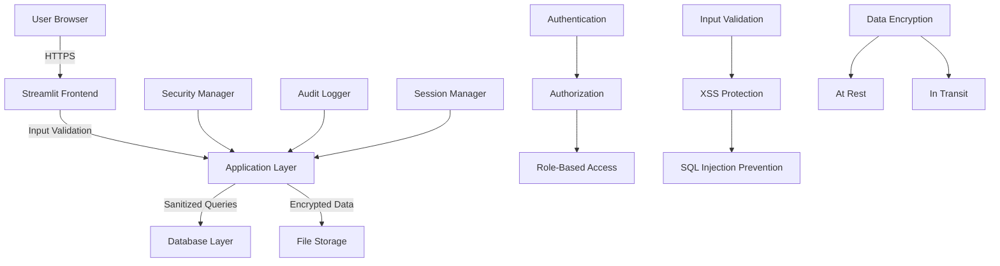

# 🔒 LitGrid Security Policy

<div align="center">


[](mailto:labib-x@protonmail.com)
[](https://github.com/la-b-ib/LitGrid/security/advisories)

</div>

**LitGrid** handles sensitive library and patron data for educational institutions, public libraries, and private collections worldwide. Security is our highest priority, and we are committed to protecting user data, maintaining system integrity, and ensuring compliance with privacy regulations.

This document outlines our security policies, vulnerability reporting procedures, and the security measures implemented in LitGrid.

---

## 📋 Table of Contents

1. [🚨 Reporting Security Vulnerabilities](#-reporting-security-vulnerabilities)
2. [🛡️ Supported Versions](#️-supported-versions)
3. [🔐 Security Architecture](#-security-architecture)
4. [🎯 Threat Model](#-threat-model)
5. [🛠️ Security Measures](#️-security-measures)
6. [📊 Data Protection](#-data-protection)
7. [🔍 Security Testing](#-security-testing)
8. [⚡ Incident Response](#-incident-response)
9. [📚 Compliance & Standards](#-compliance--standards)
10. [🎓 Security Best Practices](#-security-best-practices)
11. [🔄 Security Updates](#-security-updates)
12. [📞 Contact Information](#-contact-information)

---

## 🚨 Reporting Security Vulnerabilities

**CRITICAL**: If you discover a security vulnerability in LitGrid, please report it responsibly.

### 🔴 DO NOT Create Public Issues

**Never** create public GitHub issues, discussions, or social media posts about security vulnerabilities. This could put users at risk before patches are available.

### ✅ Responsible Disclosure Process

**Step 1: Private Reporting**

Send a detailed email to: **[labib-x@protonmail.com](mailto:labib-x@protonmail.com)**

**Step 2: Include This Information**

```markdown
Subject: [SECURITY] LitGrid Vulnerability Report - [Brief Description]

VULNERABILITY DETAILS:
- Vulnerability Type: [e.g., SQL Injection, XSS, Authentication Bypass]
- Affected Component: [e.g., Authentication system, Book search, User management]
- Severity Assessment: [Critical/High/Medium/Low]
- CVE ID (if known): [If applicable]

REPRODUCTION STEPS:
1. Step-by-step instructions
2. Include specific URLs, parameters, or inputs
3. Screenshots or video proof (if helpful)
4. Expected vs actual behavior

TECHNICAL DETAILS:
- Affected versions: [e.g., v4.0, all versions]
- Environment: [OS, Python version, browser if applicable]
- Prerequisites: [Required permissions, specific configurations]

IMPACT ASSESSMENT:
- Data exposure risk: [What data could be compromised]
- System integrity risk: [Could system be compromised]
- User impact: [How many users affected]
- Business impact: [Institutional/library operations impact]

PROOF OF CONCEPT:
- Code snippets (if applicable)
- Screenshots or recordings
- Log files (sanitized of personal data)

SUGGESTED REMEDIATION:
- Your proposed fix (optional)
- References to similar vulnerabilities
- Recommended security controls
```

**Step 3: Our Response Timeline**

* **Acknowledgment**: Within 24 hours
* **Initial Assessment**: Within 72 hours
* **Detailed Response**: Within 7 days
* **Fix Timeline**: Based on severity (see table below)

**Step 4: Coordinated Disclosure**

We follow coordinated disclosure principles:

* Work together on patch development
* Agree on disclosure timeline
* Credit researchers appropriately
* Provide security advisories when appropriate

### 🏆 Security Researcher Recognition

We appreciate security researchers who help make LitGrid safer:

* **Hall of Fame**: Recognition in our security acknowledgments
* **CVE Credits**: Proper attribution in CVE records
* **Early Access**: Preview of security improvements
* **References**: LinkedIn/professional recommendations for significant findings

### ⚡ Severity Classification & Response Times

| Severity | Description | Response Time | Fix Timeline |
|----------|-------------|---------------|--------------|
| **Critical** | Remote code execution, data breach, authentication bypass | 24 hours | 72 hours |
| **High** | Privilege escalation, sensitive data exposure | 72 hours | 7 days |
| **Medium** | Cross-site scripting, information disclosure | 7 days | 14 days |
| **Low** | Minor information leaks, non-exploitable issues | 14 days | 30 days |

---

## 🛡️ Supported Versions

We maintain security support for the following LitGrid versions:

| Version | Security Support | End of Life | Python Compatibility |
|---------|------------------|-------------|---------------------|
| **v4.x** | ✅ **Full Support** | TBD | Python 3.10+ |
| **v3.x** | ⚠️ **Critical Only** | Dec 2025 | Python 3.8+ |
| **v2.x** | ❌ **Unsupported** | Dec 2024 | Python 3.7+ |
| **v1.x** | ❌ **Unsupported** | Jun 2024 | Python 3.6+ |

### 🔄 Version Support Policy

* **Full Support**: Regular security updates, bug fixes, and feature updates
* **Critical Only**: Only critical security vulnerabilities addressed
* **Unsupported**: No security updates; users should upgrade immediately

### 📦 Upgrade Recommendations

**For Unsupported Versions:**

1. **Immediate Action Required**: Upgrade to v4.x immediately
2. **Data Backup**: Always backup before upgrading
3. **Migration Guide**: Follow our upgrade documentation
4. **Testing**: Test in non-production environment first

**For Critical-Only Support:**

1. **Plan Upgrade**: Begin planning migration to v4.x
2. **Monitor Advisories**: Subscribe to security notifications
3. **Apply Critical Patches**: Install security updates promptly

---

## 🔐 Security Architecture

### 🏗️ Security-by-Design Principles

LitGrid is built with security as a fundamental design principle:

**1. Defense in Depth**
* Multiple layers of security controls
* No single point of failure
* Fail-safe defaults

**2. Principle of Least Privilege**
* Role-based access control (RBAC)
* Minimum necessary permissions
* Regular permission reviews

**3. Zero Trust Architecture**
* Never trust, always verify
* Authenticate every request
* Authorize every action

**4. Privacy by Design**
* Data minimization
* Purpose limitation
* Consent management

### 🏛️ System Architecture Security



### 🔑 Authentication & Authorization

**Multi-Factor Authentication (MFA)**
* Support for time-based one-time passwords (TOTP)
* Email-based verification codes
* SMS verification (optional configuration)

**Session Management**
* Secure session tokens with entropy
* Session timeout and idle detection
* Concurrent session limiting
* Secure logout and session invalidation

**Role-Based Access Control (RBAC)**

| Role | Permissions | Security Level |
|------|-------------|----------------|
| **Administrator** | Full system access, user management | Highest |
| **Librarian** | Book management, member reports | High |
| **Member** | Personal account, book browsing | Standard |
| **Guest** | Limited browsing only | Minimal |

---

## 🎯 Threat Model

### 🚨 Primary Threats

**1. Data Breaches**
* **Threat**: Unauthorized access to patron data
* **Impact**: Privacy violations, regulatory fines
* **Mitigation**: Encryption, access controls, audit logging

**2. SQL Injection Attacks**
* **Threat**: Malicious database queries
* **Impact**: Data theft, system compromise
* **Mitigation**: Parameterized queries, input validation

**3. Cross-Site Scripting (XSS)**
* **Threat**: Malicious script injection
* **Impact**: Session hijacking, data theft
* **Mitigation**: Input sanitization, Content Security Policy

**4. Authentication Bypass**
* **Threat**: Unauthorized system access
* **Impact**: Complete system compromise
* **Mitigation**: Strong authentication, session management

**5. Privilege Escalation**
* **Threat**: Users gaining unauthorized permissions
* **Impact**: Data manipulation, system compromise
* **Mitigation**: RBAC, permission validation

### 📊 Risk Assessment Matrix

| Threat Category | Likelihood | Impact | Risk Level | Mitigation Priority |
|-----------------|------------|--------|------------|-------------------|
| Data Breach | Medium | Critical | **High** | 🔴 Immediate |
| SQL Injection | Low | High | **Medium** | 🟡 High |
| XSS | Medium | Medium | **Medium** | 🟡 High |
| Auth Bypass | Low | Critical | **Medium** | 🟡 High |
| Insider Threat | Low | High | **Low** | 🟢 Medium |

---

## 🛠️ Security Measures

### 🔐 Authentication Security

**Password Security**
```python
# Strong password hashing with bcrypt
password_hash = security_manager.hash_password(password)

# Password strength requirements
MIN_PASSWORD_LENGTH = 12
REQUIRE_UPPERCASE = True
REQUIRE_LOWERCASE = True
REQUIRE_NUMBERS = True
REQUIRE_SPECIAL_CHARS = True
```

**Session Security**
```python
# Secure session configuration
SESSION_TIMEOUT = 3600  # 1 hour
IDLE_TIMEOUT = 1800     # 30 minutes
MAX_LOGIN_ATTEMPTS = 5
LOCKOUT_DURATION = 900  # 15 minutes
```

### 🛡️ Input Validation & Sanitization

**Comprehensive Input Validation**
```python
def validate_book_input(title, author, isbn):
    # Length validation
    if len(title) > 200:
        raise ValidationError("Title too long")
    
    # Character validation
    if not re.match(r'^[a-zA-Z0-9\s\-\'\".,!?]+$', title):
        raise ValidationError("Invalid characters in title")
    
    # ISBN validation
    if not validate_isbn(isbn):
        raise ValidationError("Invalid ISBN format")
    
    return sanitize_input(title), sanitize_input(author), isbn
```

**XSS Prevention**
```python
def sanitize_html_input(user_input):
    # Remove dangerous HTML tags
    clean_input = re.sub(r'<script[^>]*>.*?</script>', '', user_input, flags=re.IGNORECASE)
    clean_input = re.sub(r'<[^>]+>', '', clean_input)
    
    # Escape remaining characters
    return html.escape(clean_input)
```

### 🗄️ Database Security

**SQL Injection Prevention**
```python
# ✅ Secure: Parameterized queries
def get_books_by_author(author_name):
    query = "SELECT * FROM books WHERE author = ? ORDER BY title"
    return database.fetch_all(query, (author_name,))

# ❌ Vulnerable: String concatenation
def get_books_by_author_bad(author_name):
    query = f"SELECT * FROM books WHERE author = '{author_name}'"
    return database.fetch_all(query)  # DON'T DO THIS!
```

**Database Access Controls**
```python
# Connection security
DATABASE_CONFIG = {
    'path': 'litgrid_local.db',
    'timeout': 30,
    'check_same_thread': False,
    'isolation_level': 'DEFERRED'
}

# Query timeouts
QUERY_TIMEOUT = 30  # seconds
MAX_QUERY_RESULTS = 10000  # Prevent memory exhaustion
```

### 🔒 Encryption Implementation

**Data Encryption at Rest**
```python
# Sensitive data encryption
def encrypt_sensitive_data(data):
    if not data:
        return data
    
    # Use Fernet symmetric encryption
    cipher = Fernet(encryption_key)
    encrypted_data = cipher.encrypt(data.encode())
    return base64.b64encode(encrypted_data).decode()

# Fields requiring encryption
ENCRYPTED_FIELDS = [
    'user_phone',
    'user_address',
    'emergency_contact',
    'payment_info'
]
```

**Data Encryption in Transit**
```python
# HTTPS enforcement
FORCE_HTTPS = True
HSTS_ENABLED = True
HSTS_MAX_AGE = 31536000  # 1 year

# TLS configuration
TLS_VERSION = '1.2'  # Minimum TLS version
CIPHER_SUITES = [
    'TLS_ECDHE_RSA_WITH_AES_256_GCM_SHA384',
    'TLS_ECDHE_RSA_WITH_AES_128_GCM_SHA256'
]
```

### 📋 Audit Logging

**Security Event Logging**
```python
def log_security_event(event_type, user_id, details, severity='info'):
    audit_entry = {
        'timestamp': datetime.utcnow().isoformat(),
        'event_type': event_type,
        'user_id': user_id,
        'ip_address': get_client_ip(),
        'user_agent': get_user_agent(),
        'details': details,
        'severity': severity
    }
    
    # Log to database
    database.insert_audit_log(audit_entry)
    
    # Log to file for external SIEM
    security_logger.info(json.dumps(audit_entry))
```

**Security Events We Log**
* Authentication attempts (success/failure)
* Authorization failures
* Data access and modifications
* Administrative actions
* System configuration changes
* Security policy violations

---

## 📊 Data Protection

### 🔐 Data Classification

| Data Type | Classification | Encryption | Access Control |
|-----------|----------------|------------|---------------|
| **Patron PII** | Highly Sensitive | AES-256 | Role-based |
| **Library Records** | Sensitive | AES-256 | Role-based |
| **System Logs** | Internal | AES-128 | Admin only |
| **Public Catalog** | Public | None | Read-only |

### 🛡️ Privacy Protection

**Data Minimization**
```python
# Only collect necessary data
REQUIRED_USER_FIELDS = ['email', 'name', 'role']
OPTIONAL_USER_FIELDS = ['phone', 'address', 'emergency_contact']

# Automatic data retention
DATA_RETENTION_PERIODS = {
    'audit_logs': 365,      # days
    'session_data': 30,     # days
    'inactive_users': 1095, # 3 years
    'borrowing_history': 2555  # 7 years
}
```

**Consent Management**
```python
def request_data_consent(user_id, data_types):
    """Request explicit consent for data collection"""
    consent_record = {
        'user_id': user_id,
        'data_types': data_types,
        'consent_given': False,
        'timestamp': datetime.utcnow(),
        'ip_address': get_client_ip()
    }
    
    return database.insert_consent_record(consent_record)
```

### 🌍 Regulatory Compliance

**GDPR Compliance** (European Union)
* Right to access personal data
* Right to rectification and erasure
* Data portability
* Consent management
* Breach notification (72 hours)

**FERPA Compliance** (US Educational Records)
* Educational record protection
* Parent/student consent requirements
* Directory information handling
* Disclosure limitations

**PIPEDA Compliance** (Canada)
* Privacy policy transparency
* Consent for collection and use
* Safeguarding personal information
* Individual access rights

---

## 🔍 Security Testing

### 🧪 Automated Security Testing

**Static Application Security Testing (SAST)**
```bash
# Code security analysis
bandit -r litgrid.py -f json -o security_report.json

# Dependency vulnerability scanning
pip-audit --format=json --output=dependency_vulnerabilities.json

# Secret detection
truffleHog --regex --entropy=False --json .
```

**Dynamic Application Security Testing (DAST)**
```bash
# Web application security testing
python -m pytest tests/security/ -v

# SQL injection testing
sqlmap -u "http://localhost:8501" --batch --crawl=2

# XSS testing
python security_tests/xss_scanner.py
```

### 🎯 Penetration Testing

**Regular Security Assessments**
* **Quarterly**: Automated vulnerability scans
* **Bi-annually**: Professional penetration testing
* **Annually**: Comprehensive security audit
* **Ad-hoc**: After major releases or security incidents

**Testing Scope**
* Authentication and authorization
* Input validation and sanitization
* Session management
* Data encryption
* Access controls
* API security

### 📊 Security Metrics

**Key Security Indicators (KSIs)**
```python
SECURITY_METRICS = {
    'failed_login_rate': 0.05,      # <5% failed logins
    'session_timeout_rate': 0.10,   # <10% timeout rate
    'vulnerability_detection_time': 24,  # <24 hours
    'patch_deployment_time': 72,    # <72 hours critical
    'security_training_completion': 0.95  # >95% completion
}
```

---

## ⚡ Incident Response

### 🚨 Security Incident Classification

**Severity Levels**

**🔴 Critical (Severity 1)**
* Active data breach
* System compromise
* Authentication bypass
* **Response Time**: Immediate (< 1 hour)

**🟠 High (Severity 2)**
* Potential data exposure
* Privilege escalation
* Service disruption
* **Response Time**: 4 hours

**🟡 Medium (Severity 3)**
* Security control failure
* Policy violations
* Minor vulnerabilities
* **Response Time**: 24 hours

**🟢 Low (Severity 4)**
* Security warnings
* Documentation issues
* Process improvements
* **Response Time**: 72 hours

### 📋 Incident Response Process

**Phase 1: Detection & Analysis**
1. **Alert Triage**: Validate and classify incident
2. **Impact Assessment**: Determine scope and severity
3. **Team Activation**: Notify incident response team
4. **Evidence Collection**: Preserve logs and system state

**Phase 2: Containment & Eradication**
1. **Immediate Containment**: Stop ongoing damage
2. **System Isolation**: Isolate affected systems
3. **Threat Removal**: Remove malicious elements
4. **Vulnerability Patching**: Apply security fixes

**Phase 3: Recovery & Lessons Learned**
1. **System Restoration**: Restore normal operations
2. **Monitoring**: Enhanced monitoring post-incident
3. **Documentation**: Complete incident report
4. **Process Improvement**: Update procedures

### 📞 Emergency Contacts

**Security Incident Response Team**
* **Primary Contact**: [labib-x@protonmail.com](mailto:labib-x@protonmail.com)
* **Emergency Hotline**: Available via email 24/7
* **Escalation Path**: Security team → Development team → Management

---

## 📚 Compliance & Standards

### 🏛️ Security Frameworks

**ISO 27001 Alignment**
* Information Security Management System (ISMS)
* Risk assessment and treatment
* Security controls implementation
* Continuous improvement process

**NIST Cybersecurity Framework**
* **Identify**: Asset and risk management
* **Protect**: Access controls and data protection
* **Detect**: Security monitoring and detection
* **Respond**: Incident response procedures
* **Recover**: Recovery planning and improvements

### 📋 Security Controls

**Technical Controls**
* Access controls and authentication
* Encryption and data protection
* Security monitoring and logging
* Vulnerability management
* Secure development practices

**Administrative Controls**
* Security policies and procedures
* Security awareness training
* Incident response planning
* Risk assessment processes
* Vendor security requirements

**Physical Controls** (For on-premises deployments)
* Server room security
* Equipment protection
* Environmental controls
* Media handling procedures

---

## 🎓 Security Best Practices

### 👨‍💻 For Administrators

**System Hardening**
```bash
# Regular security updates
pip install --upgrade -r requirements.txt

# Security configuration
export PYTHONHASHSEED=random
export PYTHONPATH=/secure/path/only

# Database security
chmod 600 litgrid_local.db
chown litgrid:litgrid litgrid_local.db
```

**Monitoring & Alerting**
```python
# Set up security monitoring
SECURITY_ALERTS = {
    'failed_login_threshold': 10,
    'concurrent_session_limit': 5,
    'data_export_threshold': 1000,
    'admin_action_notification': True
}
```

### 👥 For Users

**Password Security**
* Use unique, strong passwords (12+ characters)
* Enable two-factor authentication
* Don't share credentials
* Report suspicious activity immediately

**Safe Usage Practices**
* Always log out when finished
* Don't access from public computers
* Keep browser updated
* Be cautious of phishing attempts

### 👨‍💻 For Developers

**Secure Coding Guidelines**
```python
# Input validation example
def validate_user_input(data, max_length=100):
    if not isinstance(data, str):
        raise TypeError("Input must be string")
    
    if len(data) > max_length:
        raise ValueError(f"Input too long (max {max_length})")
    
    # Sanitize HTML and SQL injection attempts
    cleaned_data = security_manager.sanitize_input(data)
    return cleaned_data

# Error handling without information disclosure
try:
    result = sensitive_operation()
except Exception as e:
    # Log detailed error securely
    logger.error(f"Operation failed: {str(e)}", exc_info=True)
    
    # Return generic error to user
    return {"error": "Operation failed. Please try again."}
```

---

## 🔄 Security Updates

### 📅 Update Schedule

**Regular Security Reviews**
* **Weekly**: Dependency vulnerability checks
* **Monthly**: Security configuration review
* **Quarterly**: Security code review
* **Annually**: Comprehensive security audit

**Emergency Updates**
* **Critical vulnerabilities**: Within 24 hours
* **High-severity issues**: Within 72 hours
* **Medium-severity issues**: Next scheduled release
* **Low-severity issues**: Quarterly updates

### 🔔 Security Notifications

**How to Stay Informed**
* **GitHub Security Advisories**: [GitHub Security Tab](https://github.com/la-b-ib/LitGrid/security)
* **Email Notifications**: Subscribe to security updates
* **Release Notes**: Check for security fixes in releases
* **Security Blog**: [Project Website Security Section]

**Notification Channels**
* 🔔 **GitHub Watch**: Enable security alert notifications
* 📧 **Email List**: security-updates@litgrid.org
* 📱 **RSS Feed**: Security advisory RSS feed
* 💬 **Community**: GitHub Discussions security category

---

## 📞 Contact Information

### 🛡️ Security Team

**Primary Security Contact**
* **Name**: Labib (Project Maintainer)
* **Email**: [labib-x@protonmail.com](mailto:labib-x@protonmail.com)
* **Role**: Security Officer, Lead Developer
* **Response Time**: Within 24 hours

**Alternate Contacts**
* **GitHub Issues**: For non-sensitive security questions
* **Community Discussions**: General security discussions
* **Documentation**: Security-related documentation requests

### 🔒 PGP Key Information

For sensitive communications, use PGP encryption:

```
Public Key ID: [To be provided]
Key Fingerprint: [To be provided]
Key Server: keys.openpgp.org
```

### 🌐 External Resources

**Security Resources**
* [OWASP Top 10](https://owasp.org/www-project-top-ten/)
* [NIST Cybersecurity Framework](https://www.nist.gov/cyberframework)
* [CVE Database](https://cve.mitre.org/)
* [Security Headers](https://securityheaders.com/)

**Compliance Resources**
* [GDPR Compliance Guide](https://gdpr.eu/)
* [FERPA Guidelines](https://www2.ed.gov/policy/gen/guid/fpco/ferpa/index.html)
* [ISO 27001 Standard](https://www.iso.org/isoiec-27001-information-security.html)

---

## 📜 Security Policy Updates

**Version History**
* **v1.0** (October 2025): Initial comprehensive security policy
* **Next Review**: January 2026
* **Update Frequency**: Quarterly or as needed

**Policy Review Process**
1. **Quarterly Review**: Regular policy assessment
2. **Incident-Triggered Review**: After security incidents
3. **Regulatory Updates**: When compliance requirements change
4. **Community Feedback**: Based on user and researcher input

**Change Management**
* All policy changes are version controlled
* Major changes require security team approval
* Community notification for significant updates
* Historical versions maintained for reference

---

**🔒 Remember: Security is everyone's responsibility. If you see something, say something.**

*This security policy is a living document that evolves with our security posture and threat landscape. Your feedback and contributions to our security efforts are always welcome.*

---

*Last updated: October 2025*  
*Version: 1.0*  
*Next review: January 2026*  
*Policy applies to: LitGrid v4.0 and later*

---

###  Recommended Best Practices for Users

- Do not share editable access with unknown users
- Avoid modifying protected formulas or hidden sheets
- Keep the Google Sheet ownership secure under a trusted account
- Enable **2FA (Two-Factor Authentication)** on your Google account
- Regularly review the **Apps Script permissions** under Google Account settings

---

###  Known Issues

None currently known. Please report anything suspicious or exploitable using the contact above.

---

###  Responsible Disclosure

We strongly support responsible disclosure. All valid reports will be acknowledged, and contributors may be credited in the release notes (if desired).

---

###  Last Updated

**April 15, 2025**

## Project Documentation

<div style="display: flex; gap: 10px; margin: 15px 0; align-items: center; flex-wrap: wrap;">

[](LICENSE)
[](SECURITY.md)
[](CONTRIBUTING.md)
[](CODE_OF_CONDUCT.md)

</div>

## Contact Information


  
[](mailto:labib.45x@gmail.com)
[](https://github.com/la-b-ib)
[](https://www.linkedin.com/in/la-b-ib/)
[](https://la-b-ib.github.io/)
[](https://x.com/la_b_ib_)


